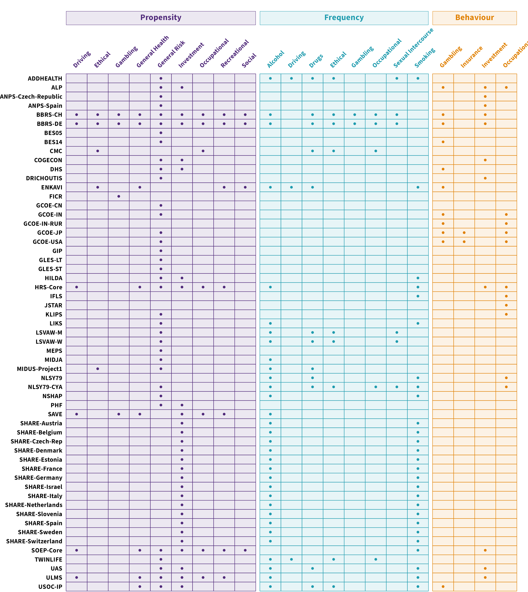

<!-- <style type="text/css"> -->
<!--   body{ -->
<!--   font-size: 12pt; -->
<!--   font-family: "Source Sans 3"; -->
<!-- } -->
<!-- </style> -->


```{r setup, include=FALSE}
knitr::opts_chunk$set(echo = FALSE, message = FALSE, warning = FALSE)
library(tidyverse)
library(knitr)

```


## Risk Preference Measures

Overview of the measures included in the analyses of the paper *The Temporal Stability of Risk Preference: A Meta-Analysis of Longitudinal Studies*.:


<br>

```{r}

```

<br>

### Codebook 
For detailed information on each measure included in the analyses refer to the study's main codebook on the OSF/GitHub repository.

<br><br>


## Overview of the Dataset by Panel 

This section offers an overview of the different samples included in the analyses of the paper *The Temporal Stability of Risk Preference: A Meta-Analysis of Longitudinal Studies*.

**Each panel is described in a separate subsection with the following information:**

- **Panel name.** Full name of the panel.

- **Description.** General description of the objectives of the panel.

- **Country/Countries.** Country or countries in which data are collected.

- **Waves.** Waves available in the raw data set *(not all waves were necessarily included in the data analysis as not every wave had collected data on the variables of interest)*

- **Data collection period.** Data collection period of the waves available in the raw data set.

- **Dataset(s) version number/name.** Version number(s) or name(s) or raw dataset(s).

- **Data access.** Link to directly access or request access to the raw dataset.


<br>
<br>


### ADDHEALTH 
```{r, echo = F}
panel_name <- "ADDHEALTH"
```


#### ABOUT

**Panel Name:** National Longitudinal Study of Adolescent to Adult Health (ADDHEALTH)

**Description:** The National Study of Adolescent to Adult Health (Add Health; Harris & Udry, 2018) is an ongoing longitudinal study of U.S. adolescents in grades 7 through 12 during the 1994-1995 school year. The initial sample of participants was approximately 20,000 students who completed at home the study. Wave II included almost 15,000 follow-up-in-home interviews with adolescents from Wave I. Currently, five waves of data collection (1994-1995, 1996, 2001-2002, 2008-2009, 2016-2018) has been completed. 
There is a set of public-use datasets available that contain all the survey data from In-Home Interviews for a subsample of the respondents.

More information at: https://addhealth.cpc.unc.edu/

**Country/Countries:** United States of America

**Waves:** Wave I - Wave V

**Data collection period:** 1994-2018

**Dataset(s) version number/name:** Waves 1-4 In-Home Questionnaire Data and Wave 5 Mixed-Mode Survey Data [Public-Use]

Harris, Kathleen Mullan, and Udry, J. Richard. National Longitudinal Study of Adolescent to Adult Health (Add Health), 1994-2018 [Public Use]. Carolina Population Center, University of North Carolina-Chapel Hill [distributor], Inter-university Consortium for Political and Social Research [distributor], 2022-08-09. https://doi.org/10.3886/ICPSR21600.v25

 *(specific data files: DS1, DS5, DS8, DS22, DS32)*

**Data access:** The Add Health public-use dataset can be downloaed via the [ICPSR Add Health page](https://www.icpsr.umich.edu/web/ICPSR/studies/21600?archive=ICPSR&q=21600). Further information on accessing the restricted datasets is available on the [Add Health Data webpage](https://addhealth.cpc.unc.edu/data/) as well as the[ Carolina Population Center Data Portal](https://data.cpc.unc.edu/projects/2/view)


<br>


### ALP 
```{r, echo = F}
panel_name <- "ALP"
```

#### ABOUT 

**Panel Name:** American Life Panel (ALP)

**Description:** The RAND American Life Panel (ALP) is a nationally representative, probability-based panel of 6,000 individuals ages 18 and older who speak English or Spanish. Participants are regularly interviewed over the internet. The ALP has conducted more than 450 surveys covering diverse topics, such as financial decision-making, health decision-making, and numeracy.

More information at: https://www.rand.org/research/data/alp.html


**Country/Countries:** United States

**Waves included in the analyses:** ms2, ms48, ms50, ms130, ms133, ms167, ms169, ms186, ms189, ms197, ms246, ms260, ms284, ms342, ms349, ms315, ms352, ms472, ms474 (survey numbers of ALP public release data)

**Data collection period (of waves included in the analyses):**  2004-2017

**Dataset(s) version number/name used for the analyses:**
Well Being 2 - Health, Risk, Expenditures (ms2). [Study page link](https://alpdata.rand.org/index.php?page=data&p=showsurvey&syid=2)
Well Being 48 - Cognition and Aging in the USA Internet Decision Making Survey [W01] (ms48). [Study page link](https://alpdata.rand.org/index.php?page=data&p=showsurvey&syid=48)
Well Being 50 - Cognition and Aging in the USA Internet Decision Making Survey [W02] (ms50). [Study page link](https://alpdata.rand.org/index.php?page=data&p=showsurvey&syid=50)
Well Being 130 - NYFED Module (ms130).  [Study page link](https://alpdata.rand.org/index.php?page=data&p=showsurvey&syid=130)
Well Being 133 - Health Expectations (ms133). [Study page link](https://alpdata.rand.org/index.php?page=data&p=showsurvey&syid=133)
Well Being 167 - NYFED Module (ms167). [Study page link](https://alpdata.rand.org/index.php?page=data&p=showsurvey&syid=167)
Well Being 169 - NYFED Module (ms169). [Study page link](https://alpdata.rand.org/index.php?page=data&p=showsurvey&syid=169)  
Well Being 186 - Long-term Care Insurance (ms186). [Study page link](https://alpdata.rand.org/index.php?page=data&p=showsurvey&syid=186)  
Well Being 189 - Savings Behavior (ms189). [Study page link](https://alpdata.rand.org/index.php?page=data&p=showsurvey&syid=189)  
Well Being 197 - Risk Aversion and Cognitive Ability (ms197). [Study page link](https://alpdata.rand.org/index.php?page=data&p=showsurvey&syid=197)  
Well Being 246 - Measuring Decision Quality (ms246). [Study page link](https://alpdata.rand.org/index.php?page=data&p=showsurvey&syid=246) 
Well Being 260 - Social Norms Marketing Interventions in Portfolio Choice (ms260). [Study page link](https://alpdata.rand.org/index.php?page=data&p=showsurvey&syid=260) 
Well Being 284 - National Financial Capability Study (ms284). [Study page link](https://alpdata.rand.org/index.php?page=data&p=showsurvey&syid=284) 
Well Being 315 - Decision Quality [Composite 1] (ms315). [Study page link](https://alpdata.rand.org/index.php?page=data&p=showsurvey&syid=315) 
Well Being 342 - NBER [2] Followup to 341 Insurance (ms342). [Study page link](https://alpdata.rand.org/index.php?page=data&p=showsurvey&syid=342) 
Well Being 349 - Affordable Care Act (ms349). [Study page link](https://alpdata.rand.org/index.php?page=data&p=showsurvey&syid=349) 
Well Being 352 - Decision Quality [Composite 2] (ms352). [Study page link](https://alpdata.rand.org/index.php?page=data&p=showsurvey&syid=352)
Well Being 472 - Copy of ms352 - Decision Quality [Composite 2] (ms472). [Study page link](https://alpdata.rand.org/index.php?page=data&p=showsurvey&syid=472)
Well Being 474 - Copy of ms315 - Decision Quality [Composite 1] (ms474). [Study page link](https://alpdata.rand.org/index.php?page=data&p=showsurvey&syid=474)


**Data access:** To access ALP public release data one must first register as a user, more information available on the [Access ALP Data page] (https://www.rand.org/research/data/alp/data-access.html) The public release data can then be download via the [ALP data catalogue](https://alpdata.rand.org/?page=data)

<br>
<br>


### ANPS SPAIN 
```{r, echo = F}
panel_name <- "ANPS_Spain"
```

#### ABOUT

**Panel Name:** Study by Adema, Nikolka, Poutvaara, & Sunde (2022) (ANPS)

**Description:** Study conducted by Adema et al., (2022) published in Economics Letters.  The study investigated the stability of risk preferences in the context of the COVID-19 pandemic. The survey was sent out to 9 universities located in 4 different countries (Czechia, India, Mexico, and Spain).

Adema, J., Nikolka, T., Poutvaara, P., & Sunde, U. (2022). On the stability of risk preferences: Measurement matters. *Economics Letters, 210*, 110172.


**Country/Countries:** Spain

**Waves:** W1 and W2

**Data collection period:** Around 2019-2021

**Dataset(s) version number/name:** Main data set available on Mendely Data (ANPS_main.csv)

**Data access:** Nikolka, Till; Poutvaara, Panu; Sunde, Uwe ; Adema, Joop (2021), “Supplementary Data to "On the Stability of Risk Preferences: Measurement Matters"”, Mendeley Data, V2, doi: 10.17632/jzysn9brrb.2


<br>
<br>


### ANPS CZECH REPUBLIC 
```{r, echo = F}
panel_name <- "ANPS_Czech_Rep"
```

#### ABOUT

**Panel Name:** Study by Adema, Nikolka, Poutvaara, & Sunde (2022) (ANPS)

**Description:** Study conducted by Adema et al., (2022) published in Economics Letters.  The study investigated the stability of risk preferences in the context of the COVID-19 pandemic. The survey was sent out to 9 universities located in 4 different countries (Czechia, India, Mexico, and Spain).

Adema, J., Nikolka, T., Poutvaara, P., & Sunde, U. (2022). On the stability of risk preferences: Measurement matters. *Economics Letters, 210*, 110172.


**Country/Countries:** Czech Republic

**Waves:** W1 and W2

**Data collection period:** Around 2019-2021

**Dataset(s) version number/name:** Main data set available on Mendely Data (ANPS_main.csv)

**Data access:** Nikolka, Till; Poutvaara, Panu; Sunde, Uwe ; Adema, Joop (2021), “Supplementary Data to "On the Stability of Risk Preferences: Measurement Matters"”, Mendeley Data, V2, doi: 10.17632/jzysn9brrb.2


<br>
<br>


### BBRS CH 
```{r, echo = F}
panel_name <- "BBRS_Basel"
```

#### ABOUT

**Panel Name:** Basel-Berlin Risk Study - Basel Sample (BBRS_Basel)

**Description:** Study conducted by Frey et al., (2017) published in Science Advances (full reference below).  The study investigated to what extent there is a general factor of risk preference, and whether risk preference can be regarded as a stable psychological trait. In this study 1'507 healthy adults completed 39 risk-taking measures. A subsample completed a retest session. Data was collected in two cities (BBRS_Basel and BBRS_Berlin).

Frey, R., Pedroni, A., Mata, R., Rieskamp, J., & Hertwig, R. (2017). Risk preference shares the psychometric structure of major psychological traits. *Science Advances, 3,* e1701381.

**Country/Countries:** Switzerland

**Waves:** main_basel (W1), retest_basel (W2)

**Data collection period:** Around 2015

**Dataset(s) version number/name:** From the main and retest_basel folders on the Open Science Framework repository  - *bart.csv, cct_overt.csv, dfd_perpers.csv, dfe_perpers.csv, lotteriesOvert.csv, mplBehavior.csv, mt.csv, participants.csv, quest_proc.csv*

**Data access:** [Open Science Framework repository](https://osf.io/rce7g/)


<br>
<br>


### BBRS DE 
```{r, echo = F}
panel_name <- "BBRS_Berlin"
```

#### ABOUT

**Panel Name:** Basel-Berlin Risk Study - Berlin Sample (BBRS_Berlin)

**Description:** Study conducted by Frey et al., (2017) published in Science Advances (full reference below).  The study investigated to what extent there is a general factor of risk preference, and whether risk preference can be regarded as a stable psychological trait. In this study 1'507 healthy adults completed 39 risk-taking measures. A subsample completed a retest session. Data was collected in two cities (BBRS_Basel and BBRS_Berlin).

Frey, R., Pedroni, A., Mata, R., Rieskamp, J., & Hertwig, R. (2017). Risk preference shares the psychometric structure of major psychological traits. *Science Advances, 3,* e1701381.

**Country/Countries:** Germany

**Waves:** main_berlin (W1), retest_berlin (W2)

**Data collection period:** Around 2015

**Dataset(s) version number/name:** From the main and retest_berlin folders on the Open Science Framework repository  - *bart.csv, cct_overt.csv, dfd_perpers.csv, dfe_perpers.csv, lotteriesOvert.csv, mplBehavior.csv, mt.csv, participants.csv, quest_proc.csv*

**Data access:** [Open Science Framework repository](https://osf.io/rce7g/)


<br>
<br>


### BES05 
```{r, echo = F}
panel_name <- "BES05"
```

#### ABOUT

**Panel Name:** British Election Study 2005 (BES05)

**Description:** The British Election Study Nine-Wave Panel Survey, contains panel data from nine surveys conducted between the 2005 and 2010 general elections. The initial sample of participants who completed the survey online was around 8,000. The nine waves were collected as follows: three waves in 2005, conducted before the election campaign, during the campaign and post-election; one wave conducted in 2006, one in 2008 and one in 2009; and three waves conducted in 2010, before the election campaign, during the campaign and post-election. The surveys covered topics such as electoral issues, voting intentions and behaviour, as well as social and political attitudes.

More information on the [UK Data Service study catalogue](https://beta.ukdataservice.ac.uk/datacatalogue/studies/study?id=6607#!/details)

**Country/Countries:** United Kingdom

**Waves:** Pre-Election 2005 (Internet) & Pre-Campaign 2010

**Data collection period:** 2005-2010

**Dataset(s) version number/name:** Stewart, M., Sanders, D., Whiteley, P. F., Clarke, H. (2014). *British Election Study Nine-Wave Panel Survey, 2005-2010.* [data collection]. *2nd Edition*. UK Data Service. SN: 6607, http://doi.org/10.5255/UKDA-SN-6607-2

**Data access:** Data can be requested and downloaded via the study specific page of the [UK Data Service study catalogue](https://beta.ukdataservice.ac.uk/datacatalogue/studies/study?id=6607#!/details) 


<br>
<br>


### BES14 
```{r, echo = F}
panel_name <- "BES14"
```

#### ABOUT

**Panel Name:** The British Election Study 2014-2023 (BES14)

**Description:** The British Election Study Internet Panel is a longitudinal study on changes in attitudes and voting preferences in the United Kingdom. Surveys take place after every important election, helping researchers understand changing patterns of party support and election outcomes. The first survey was distributed in February 2014 to around 30,000 participants. 

More information on the  [British Election Study webpage](https://www.britishelectionstudy.com/bes-resources/about-the-bes-internet-panel-study/)

**Country/Countries:** United Kingdom

**Waves:** 2014-2020

**Data collection period:** 2014-2020 *(data collection will continue until 2023)*

**Dataset(s) version number/name:** Fieldhouse, E., J. Green, G. Evans, J. Mellon & C. Prosser, R. de Geus, J. Bailey, H. Schmitt and C. van der Eijk (2020) British Election Study Internet Panel Waves 1-20.

**Data access:** Data can be requested and downloaded via the panel specific page of the [British Election Study panel data catalogue](https://www.britishelectionstudy.com/data-object/british-election-study-combined-wave-1-20-internet-panel/)


<br>
<br>


### CMC 
```{r, echo = F}
panel_name <- "CMC"
```

#### ABOUT

**Panel Name:** Crime in the Modern City. A Longitudinal Study of Juvenile Delinquency in Münster (CMC)

**Description:** This longitudinal study includes children and adolescents who attended school in Münster in the 7th grade in 2000. They were surveyed again in 2001, 2002 and 2003. The survey contain topics such as attitudes towards violence, crime and school as well as alcohol and drug consumption. The data collector is the Institute for Criminal Research at the Westfälische Wilhelms-Universität.

More information at: https://search.gesis.org/research_data/ZA7480

**Country/Countries:** Germany

**Waves included in the analyses:**  2000, 2001, 2002 and 2003 (Wave 1 - Wave 4)

**Data collection period (of waves included in the analyses):** 2000-2003

**Dataset(s) version number/name used for the analyses:**
Boers, Klaus, & Reinecke, Jost (2019). Crime in the Modern City. A Longitudinal Study of Juvenile Delinquency in Münster - Panel Study in 4 Waves (2000 - 2003). GESIS Data Archive, Cologne. ZA7480 Data file Version 1.0.0, https://doi.org/10.4232/1.13287.

**Data access:** Access to the data can be requested on the GESIS [CMC study webpage](https://search.gesis.org/research_data/ZA7480)


<br>
<br>


### COGECON 
```{r, echo = F}
panel_name <- "COGECON"
```

#### ABOUT

**Panel Name:** Cognitive Economics Project (COGECON)

**Description:** The Cognitive Economics Project is a panel study focusing on the decision-making of aging citizens. This project was designed the increase the understanding of the cognitive bases of economic decision-making. Researchers collect data on topics such as: wealth, income, risk preference, affect, and cognition. The study was conducted from 2008 until 2017, yielding 5 waves.

More information at: https://ebp-projects.isr.umich.edu/CogEcon/

**Country/Countries:** United States

**Waves included in the analyses:** 2008, 2009, 2011 and 2013

**Data collection period (of waves included in the analyses):** 2008 - 2013

**Dataset(s) version number/name used for the analyses:**
PCognitive Economics Study Data (*the list of datasets can be viewed [here](https://hrsdata.isr.umich.edu/data-products/cogecon)*)
CogEcon 2008-2009: Latest release - Jan 2012 (Ver 1.0)
CogEcon 2011: Latest release - Jan 2011 (Ver 1.2)
CogEcon 2013: Latest release - Jan 2013 (Ver 1.0)

**Data access:** Access to the data can be requested via the [HRS Data Portal](https://hrsdata.isr.umich.edu/). Additional informnation can be found on the Access to Cognitive Economics Project Data [page](https://ebp-projects.isr.umich.edu/CogEcon/data.html)


<br>
<br>


### DHS 
```{r, echo = F}
panel_name <- "DHS"
```

#### ABOUT

**Panel Name:** DNB Household Survey (DNB)

**Description:** The DNB Household Survey, undertaken by CentERdata at Tilburg University since 1993, provides annual financial information on 2,000 Dutch households. DNB Household Survey include 6 questionnaires that cover topics such as : work, accommodation, health, assets and psychological concepts

More information at: https://www.centerdata.eu/en/projects-by-centerdata/dnb-household-survey-dhs

**Country/Countries:** Netherlands

**Waves:** 1993-2022

**Data collection period:** 1993-2022

**Dataset(s) version number/name:** Used data from the PSY and HHI modules for years 1993-2022, for 1993 also used data from the WRK module


**Data access:** Access to the data can be requested via the [CentERdata's website](https://www.centerdata.eu/en/databank/dhs-data-access). The data sets can then be downloaded on the [DHS data access website](https://www.dhsdata.nl/site/users/login)


<br>
<br>


### DRICHOUTIS 
```{r, echo = F}
panel_name <- "DRICHOUTIS"
```

#### ABOUT

**Panel Name:** Study by Drichoutis & Vassilopoulos (2019)

**Description:** Study conducted by Drichoutis & Vassilopoulos (2019) published in Journal of Economics & Management Strategy.  The study investigated the intertemporal stability of six related survey‐based measures over a course of 3 waves. These survey measures assessed risk, time, and social preferences.

Drichoutis, A. C., & Vassilopoulos, A. (2021). Intertemporal stability of survey‐based measures of risk and time preferences. *Journal of Economics & Management Strategy, 30*(3), 655-683.


**Country/Countries:** Greece

**Waves:** W1, W2, and W3

**Data collection period:** 2013-2015

**Dataset(s) version number/name:** *data.dta* file from [Open Science Repository](https://osf.io/xkj43/)


**Data access:** [Open Science Repository](https://osf.io/xkj43/)


<br>
<br>


### ENKAVI 
```{r, echo = F}
panel_name <- "ENKAVI"
```

#### ABOUT

**Panel Name:** Study by Enkavi et al., (2019) Large-scale analysis of test–retest reliabilities of self-regulation measures (ENKAVI)

**Description:** Study conducted by Enkavi et al., (2019) published in Proceedings of the National Academy of Sciences (full reference below). The paper examined test-retest reliability across various self-report and behavioral measures relevant to self-regulation. 
Retest data was collected from 150 participants who were a subset of a sample from another study (Eisenberg et al., 2018). Data was collected between 2016 and 2017 via MTurk.

Enkavi, A. Z., Eisenberg, I. W., Bissett, P. G., Mazza, G. L., MacKinnon, D. P., Marsch, L. A., & Poldrack, R. A. (2019). Large-scale analysis of test-retest reliabilities of self-regulation measures. *Proceedings of the National Academy of Sciences of the United States of America, 116*(12), 5472–5477. https://doi.org/10.1073/pnas.1818430116

Eisenberg, I. W., et al. (2018). Applying novel technologies and methods to inform the ontology of self-regulation. *Behaviour research and therapy, 101*, 46–57. https://doi.org/10.1016/j.brat.2017.09.014

**Country/Countries:** United States 

**Waves:** *Wave 1 and Wave 2* 

**Data collection period:** 2016-2017

**Dataset(s) version number/name:** Complete_02-16-2019 *(variables_exhaustive.csv, alcohol_drugs.csv, demographics.csv and demographics_survey.csv)* and Retest_02-16-2019 *(variables_exhaustive.csv, alcohol_drugs.csv, demographics.csv and demographics_survey.csv)*

**Data access:** [GitHub Repository](https://github.com/IanEisenberg/Self_Regulation_Ontology/tree/master/Data)


<br>
<br>


### GCOE (China Urban Sample) 
```{r, echo = F}
panel_name <- "GCOE_CN"
```

#### ABOUT

**Panel Name:** Preference Parameters Study - China Urban Sample (GCOE_CN) 

**Description:** The Preference Parameters Study of Osaka University is an extensive panel study conducted in 4 different countries (Japan, United States, China and India). The study includes measures to assess time preference, risk aversion, habit formation as well as externality. 

For the survey in the Chinese urban area, the panel survey was conducted in six cities (Beijing, Shanghai, Guangzhou, Chengdu, Wuhan, Shenyang) since 2009 with a sample of men and women aged 20-69 years old.

More information at: https://www.iser.osaka-u.ac.jp/survey_data/eng_panelsummary.html

**Country/Countries:** China

**Waves included in the analyses:** 2009 and 2010

**Data collection period (of waves included in the analyses):** 2009-2010

**Dataset(s) version number/name used for the analyses:**
2009Data_CHINA and 2010Data_CHINA.

**Data access:** Access to the data can be requested via the form available on the [Data Application page](https://www.iser.osaka-u.ac.jp/survey_data/eng_application.html)


<br>
<br>


### GCOE (India Urban Sample) 
```{r, echo = F}
panel_name <- "GCOE_IN"
```

#### ABOUT

**Panel Name:** Preference Parameters Study - India Urban Sample (GCOE_IN) 

**Description:** The Preference Parameters Study of Osaka University is an extensive panel study conducted in 4 different countries (Japan, United States, China and India). The study includes measures to assess time preference, risk aversion, habit formation as well as externality. 

For the survey in the India urban areas, the panel survey has been conducted annually from 2009 to 2013. Samples of men and women aged 20-69 living in urban areas of six cities (Delhi, Mumbai, Bangalore, Chennai, Calcutta, Hyderabad) were interviewed.

More information at: https://www.iser.osaka-u.ac.jp/survey_data/eng_panelsummary.html

**Country/Countries:** India

**Waves included in the analyses:** 2009-2013

**Data collection period (of waves included in the analyses):** 2009-2013

**Dataset(s) version number/name used for the analyses:** 
2009Data_INDIA, 2010Data_INDIA, 2011Data_INDIA, 2012Data_URBAN_INDIA, 2013Data_URBAN_INDIA

**Data access:** Access to the data can be requested via the form available on the [Data Application page](https://www.iser.osaka-u.ac.jp/survey_data/eng_application.html)


<br>
<br>


### GCOE (Japan Sample) 
```{r, echo = F}
panel_name <- "GCOE_JP"
```

#### ABOUT

**Panel Name:** Preference Parameters Study -  Japan Sample (GCOE_JP)

**Description:** The Preference Parameters Study of Osaka University is an extensive panel study conducted in 4 different countries (Japan, United States, China and India). The study includes measures to assess time preference, risk aversion, habit formation as well as externality. 

The panel survey in Japan has been conducted annually from 2003 until 2018 using a random sample  of men and women aged 20-69 years old by a self-administered placement method.

More information at: https://www.iser.osaka-u.ac.jp/survey_data/eng_panelsummary.html

**Country/Countries:** Japan

**Waves included in the analyses:** 2003-2018

**Data collection period (of waves included in the analyses):** 2003-2018

**Dataset(s) version number/name used for the analyses:** 
2003Data_JAPAN, 2004Data_JAPAN, 2005Data_JAPAN, 2006Data_JAPAN, 2007Data_JAPAN, 2008Data_JAPAN, 2009Data_JAPAN, 2010Data_JAPAN, 2011Data_JAPAN, 2012Data_JAPAN, 2013Data_JAPAN, 2016Data_JAPAN, 2017Data_JAPAN, 2018Data_JAPAN

**Data access:** Access to the data can be requested via the form available on the [Data Application page](https://www.iser.osaka-u.ac.jp/survey_data/eng_application.html)


<br>
<br>


### GCOE (USA Sample) 
```{r, echo = F}
panel_name <- "GCOE_USA"
```


#### ABOUT

**Panel Name:** Preference Parameters Study - USA Sample  (GCOE_USA) 

**Description:** The Preference Parameters Study of Osaka University is an extensive panel study conducted in 4 different countries (Japan, United States, China and India). The study includes measures to assess time preference, risk aversion, habit formation as well as externality. 
The panel survey for the GCOE USA sample has been conducted annually from 2005 to 2013 using a random sample of men and women aged 18-99 years old.

More information at: https://www.iser.osaka-u.ac.jp/survey_data/eng_panelsummary.html

**Country/Countries:** United States of America

**Waves included in the analyses:** 2005-2013

**Data collection period (of waves included in the analyses):** 2005-2013

**Dataset(s) version number/name used for the analyses:**
2005Data_USA, 2006Data_USA, 2007Data_USA, 2008Data_USA, 2009Data_USA, 2010Data_USA, 2011Data_USA, 2012Data_USA, 2013Data_USA.

**Data access:** Access to the data can be requested via the form available on the [Data Application page](https://www.iser.osaka-u.ac.jp/survey_data/eng_application.html)


<br>
<br>


### GIP 
```{r, echo = F}
panel_name <- "GIP"
```


#### ABOUT

**Panel Name:** German Internet Panel (GIP)

**Description:** The German Internet Panel (GIP) is a longitudinal study developped by the University of Mannheim and the central infrastructure project of the Collaborative Research Center (SFB) 884 “Political Economy of Reforms”, which is funded by the German Research Foundation (DFG). The panel studies attitudes and preferences relevant in political and economic decision-making processes. Approximately 4,000 people in Germany are regularly interviewed online on a variety of topics.
More information at: https://www.uni-mannheim.de/en/gip/

**Country/Countries:** Germany

**Waves included in the analyses:** W9, W14, W56

**Data collection period (of waves included in the analyses):** 2014 and 2021

**Dataset(s) version number/name used for the analyses:**
This article uses data from the wave(s) 9, 14, and 56 of the German Internet Panel (GIP; DOI: [10.4232/1.12615; 10.4232/1.12620; 10.4232/1.13945]; Blom et al. (2014)). A study description can be found in Blom et al. (2015). The GIP is funded by the German Research Foundation (DFG) as part of the Collaborative Research Center 884 (SFB 884; Project Number 139943784; Project Z1).

Blom, A. G., Gathmann, C., and Krieger, U. (2015). Setting Up an Online Panel Representative of the General Population: The German Internet Panel. Field Methods, 27(4), 391–408. DOI: 10.1177/1525822X15574494

**Data access:** Instructions on how to access the data can be found on the [Data Access page](https://www.uni-mannheim.de/en/gip/for-data-users/#c232077)


<br>
<br>


### GLES LT 
```{r, echo = F}
panel_name <- "GLES_LT"
```

#### ABOUT

**Panel Name:** GLES Panel 2016-2021 (Long-Term Panel; GLES-LT)

**Description:** The German Longitudinal Election Study (GLES) collects data on the political attitudes and behaviour of voters and candidates. It is carried in close cooperation between the German Society for Electoral Studies (DGfW) and the GESIS – Leibniz Institute for the Social Sciences. GLES conducts surveys before and after the German federal elections, allowing data to be analyzed in a longitudinal as well as cross-sectional manner. 

This specific data set has data on respondents with German citizenship resident in the Federal Republic of Germany, who had a minimum age of 16 years and lived in private households at the time the survey was being conducted.

More information is available on the [GLES website](https://gles-en.eu/)

**Country/Countries:** Germany

**Waves:**
 - GLES Panel 2016-2021, Waves 1-15, ZA6838. Waves:	1, a1, a2, 13, 14 and 15

**Data collection period:** 2015 - 2020

**Dataset(s) version number/name:** 
GLES (2021). GLES Panel 2016-2021, Waves 1-15. GESIS Data Archive, Cologne. ZA6838 Data file Version 5.0.0, https://doi.org/10.4232/1.13783.


**Data access:** After registering on the [GESIS website](https://login.gesis.org/realms/gesis/login-actions/registration?client_id=soda-app&tab_id=nnSLvFUl08A), the data can be downloaded directly via the page of each data set


<br>
<br>


### GLES ST 
```{r, echo = F}
panel_name <- "GLES_ST"
```

#### ABOUT

**Panel Name:** German Longitudinal Election Study - Short term Campaign (GLES-ST)

**Description:** The German Longitudinal Election Study (GLES) collects data on the political attitudes and behaviour of voters and candidates. It is carried in close cooperation between the German Society for Electoral Studies (DGfW) and the GESIS – Leibniz Institute for the Social Sciences. GLES conducts surveys before and after the German federal elections, allowing data to be analyzed in a longitudinal as well as cross-sectional manner. 

This specific data set has data on respondents who were eligible to vote in the election to the German Bundestag in 2013 and 2017 and who took part in the Campaign Panel.

More information is available on the [GLES website](https://gles-en.eu/)

**Country/Countries:** Germany

**Waves:**
 - Repeatedly questioned respondents of the Short-term Campaign Panel 2013 and 2017 (GLES), ZA6827. Waves: 9 and 10

**Data collection period:** 2013 - 2017

**Dataset(s) version number/name:** 

GLES (2018). Repeatedly questioned respondents of the Short-term Campaign Panel 2013 and 2017 (GLES). GESIS Data Archive, Cologne. ZA6827 Data file Version 1.0.0, https://doi.org/10.4232/1.13129.

**Data access:** After registering on the [GESIS website](https://login.gesis.org/realms/gesis/login-actions/registration?client_id=soda-app&tab_id=nnSLvFUl08A), the data can be downloaded directly via the page of each data set


<br>
<br>


### HILDA 
```{r, echo = F}
panel_name <- "HILDA"
```

#### ABOUT

**Panel Name:** Household, Income and Labour Dynamics in Australia (HILDA)

**Description:** The Household, Income and Labour Dynamics in Australia (HILDA) Survey is a household-based panel study that collects information about economic and personal well-being, labour market dynamics and family life of participants. Since 2001, the study has been following more than 17,000 Australian participants each year.

More information at: https://melbourneinstitute.unimelb.edu.au/hilda

**Country/Countries:** Australia

**Waves included in the analyses:**  Wave 1 - Wave 19

**Data collection period (of waves included in the analyses):** 2001-2019

**Dataset(s) version number/name used for the analyses:** Department of Social Services; Melbourne Institute of Applied Economic and Social Research, 2020, "The Household, Income and Labour Dynamics in Australia (HILDA) Survey, GENERAL RELEASE 19 (Waves 1-19)", doi:10.26193/3QRFMZ, ADA Dataverse, V5
*(specific data files: Rperson ***190c files)*

**Data access:** Data can be requested and downloaded via the [National Centre for Longitudinal Data Dataverse](https://dataverse.ada.edu.au/dataverse/ncld). 


<br>
<br>


### HRS 
```{r, echo = F}
panel_name <- "HRS"
```

#### ABOUT

**Panel Name:** Health and Retirement Study (HRS)

**Description:** The Health and Retirement Study (HRS) is a longitudinal panel study that surveys a representative sample of approximately 20,000 individuals of 50+ years old living in the United States of America. A new cohort of individuals between 51 and 56 years old is added every 6 years. Individuals and their spouses/partners are followed until their death.  The survey focuses on financial and social factors. Data have been collected biannually since 1992.

More information at: https://hrs.isr.umich.edu/about

**Country/Countries:** United States of America

**Waves included in the analyses:** Waves 1992 - 2018 

**Data collection period (of waves included in the analyses):** 1992 - 2018 

**Dataset(s) version number/name used for the analyses:**
Public Survey Data: Biennial Data - HRS Core (*the list of datasets can be viewed [here](https://hrsdata.isr.umich.edu/data-products/public-survey-data)*)
1992 HRS Core: Latest Release - Sep 2004 (Final V2.0)
1994 HRS Core: Latest Release - Sep 2004 (Final V2.0)
1996 HRS Core: Latest Release - Mar 2007 (Final V4.00)
1998 HRS Core: Latest Release - Nov 2003 (Final V2.3)
2000 HRS Core: Latest Release - Apr 2004 (Final V1.0)
2002 HRS Core: Latest Release - Jul 2006 (Final V2.0)
2004 HRS Core: Latest Release - May 2016 (Final V1.0)
2006 HRS Core: Latest Release - Aug 2021 (Final V4.0) 
2008 HRS Core: Latest Release - Dec 2014 (Final V3.0)
2010 HRS Core: Latest Release - Aug 2021 (Final V6.0)
2012 HRS Core: Latest Release - Mar 2020 (Final V3.0)
2014 HRS Core: Latest Release - Dec 2017 (Final V2.0)
2016 HRS Core: Latest Release - Dec 2019 (Final V2.0)
2016 HRS Core: Latest Release - Dec 2019 (Early V1.0)


**Data access:** Access to the data can be requested via the [HRS Data Portal](https://hrsdata.isr.umich.edu/). 


<br>
<br>


### LIKS 
```{r, echo = F}
panel_name <- "LIKS"
```


#### ABOUT

**Panel Name:** Life in Kyrgyzstan Study (LIKS)

**Description:** The ‘Life in Kyrgyzstan’ Study is a longitudinal survey of households and individuals in Kyrgyzstan. It tracks the same 3,000 households and 8,000 individuals over time in all seven Kyrgyz regions (oblasts) and the two cities of Bishkek and Osh. The data are representative nationally and at the regional level (East, West, North, South).
The survey interviews all adult household members about household demographics, assets, expenditure, migration, employment, agricultural markets, shocks, social networks, subjective well-being, and many other topics. Some of these topics are addressed in each wave while other topics are only addressed in selected waves. All members of the households in 2010 are tracked for each wave and new household members are added to the survey and tracked as well. The survey was first conducted in 2010 and it has been repeated four times in 2011, 2012, 2013 and 2016. 

More information at: https://lifeinkyrgyzstan.org/about/

**Country/Countries:** Kyrgyzstan

**Waves included in the analyses:** 2010, 2011, 2012, 2013, 2016

**Data collection period (of waves included in the analyses):** 2010-2016

**Dataset(s) version number/name used for the analyses:**
Life in Kyrgyzstan Study, 2013. Research Data Center of IZA (IDSC). Version 1.0, doi:10.15185/izadp.7055.1
*When conducting the data analyses, the 2019 data was not available. (specific data files: individual data)*

**Data access:** Access to the data can be requested via the International Data Service Center of the Institute for Study of Labour (IDSC IZA) [Data Set Repository](https://datasets.iza.org//dataset/124/life-in-kyrgyzstan-panel-study-2013). 


<br>
<br>


### LSVAW M 
```{r, echo = F}
panel_name <- "LSVAW_M"
```

#### ABOUT

**Panel Name:** Longitudinal Study of Violence Against Women: Victimization and Perpetration Among College Students in a State-Supported University in the United States (LSVAW - Men sample)

**Description:** Study aimed at investigating the developmental antecedents of physical and sexual violence against young women. The sample was constituted of  males that woman who had responded to the survey reported having had sexual intercourse with.

More information on the [ICPSR website](https://www.icpsr.umich.edu/web/NACJD/studies/3212)

**Country/Countries:** United States of America

**Waves:** 1990-1995

**Data collection period:** 1990-1995

**Dataset(s) version number/name:** *DS2 Male Data*

White, Jacquelyn W., University of North Carolina-Greensboro, and Humphrey, John A. Longitudinal Study of Violence Against Women: Victimization and Perpetration Among College Students in a State-Supported University in the United States, 1990-1995. Inter-university Consortium for Political and Social Research [distributor], 2015-09-11. https://doi.org/10.3886/ICPSR03212.v1


**Data access:** Data can be downloaded via the [ICPSR page of the study](https://www.icpsr.umich.edu/web/NACJD/studies/3212/datadocumentation)


<br>
<br>


### LSVAW W 
```{r, echo = F}
panel_name <- "LSVAW_W"
```

#### ABOUT

**Panel Name:** Longitudinal Study of Violence Against Women: Victimization and Perpetration Among College Students in a State-Supported University in the United States (LSVAW - Women sample)

**Description:** Study aimed at investigating the developmental antecedents of physical and sexual violence against young women. Data for the female sample were collected when women were aged 18 years old, and again when they were 19, 20, 21, and 22 years old. 

More information on the [ICPSR website](https://www.icpsr.umich.edu/web/NACJD/studies/3212)

**Country/Countries:** United States of America

**Waves:** 1990-1995

**Data collection period:** 1990-1995

**Dataset(s) version number/name:** *DS1 Female Data*

White, Jacquelyn W., University of North Carolina-Greensboro, and Humphrey, John A. Longitudinal Study of Violence Against Women: Victimization and Perpetration Among College Students in a State-Supported University in the United States, 1990-1995. Inter-university Consortium for Political and Social Research [distributor], 2015-09-11. https://doi.org/10.3886/ICPSR03212.v1


**Data access:** Data can be downloaded via the [ICPSR page of the study](https://www.icpsr.umich.edu/web/NACJD/studies/3212/datadocumentation)


<br>
<br>


### MEPS 
```{r, echo = F}
panel_name <- "MEPS"
```

#### ABOUT

**Panel Name:** Medical Expenditure Panel Survey (MEPS)

**Description:** The Medical Expenditure Panel Survey (MEPS) is a set of large-scale surveys of families and individuals, their medical providers, and employers across the United States. MEPS collects data on the specific health services that Americans use, how frequently they use them, the cost of these services, and how they are paid for, as well as data on the cost, scope, and breadth of health insurance held by and available to U.S. workers. MEPS currently has two major components for which data are released: the Household Component and the Insurance Component. In the Household Component, the number of families recruited have ranged from around 8,000 to 15,000. The survey was launched in 1996 and continues to collect data until today on an annual basis. Data is also collected from respondents who participated in two surveys (approx. a year a part).

More information on the [MEPS website](https://www.meps.ahrq.gov/mepsweb/about_meps/survey_back.jsp)

**Country/Countries:** United States of America

**Waves:** 2000-2017

**Data collection period:** 1996-present

**Dataset(s) version number/name:** *See PUF No. and File name list below*

HC-202:  MEPS Panel 21 Longitudinal Data File
HC-193:  MEPS Panel 20 Longitudinal Data File
HC-183:  MEPS Panel 19 Longitudinal Data File
HC-172:  MEPS Panel 18 Longitudinal Data File
HC-164:  MEPS Panel 17 Longitudinal Data File
HC-156:  MEPS Panel 16 Longitudinal Data File
HC-148:  MEPS Panel 15 Longitudinal Data File
HC-139:  MEPS Panel 14 Longitudinal Data File
HC-130:  MEPS Panel 13 Longitudinal Data File
HC-122:  MEPS Panel 12 Longitudinal Data File
HC-114:  MEPS Panel 11 Longitudinal Data File
HC-106:  MEPS Panel 10 Longitudinal Data File
HC-098:  MEPS Panel 9 Longitudinal Data File
HC-086:  MEPS Panel 8 Longitudinal Data File
HC-080:  MEPS Panel 7 Longitudinal Data File
HC-071:  MEPS Panel 6 Longitudinal Data File
HC-065:  MEPS Panel 5 Longitudinal Data File


**Data access:** Data can be downloaded via the [MEPS Longitudinal Data File page](https://www.meps.ahrq.gov/mepsweb/data_stats/download_data_files_results.jsp?cboDataYear=All&cboDataTypeY=1%2CHousehold+Full+Year+File&buttonYearandDataType=Search&cboPufNumber=All&SearchTitle=Longitudinal)


<br>
<br>


### MIDJA 
```{r, echo = F}
panel_name <- "MIDJA"
```

#### ABOUT

**Panel Name:** Midlife in Japan (MIDJA)

**Description:**  Midlife in Japanese a longtiduate study conducted with the purpose to compare the results with the United States sample (MIDUS). Baseline and follow-up survey responses were collected from a sample of Japanese adults. The MIDJA survey contains a similar set of questions as MIDUS, it is interested in the associations between psychosocial factors and health.

More information on the MIDJA page of the [MIDUS website](https://midus.wisc.edu/midja/index.php)

**Country/Countries:** Japan

**Waves:** MIDJA 1, MIDJA 2

**Data collection period:** 2008, 2012

**Dataset(s) version number/name:** 


MIDJA 1: Ryff, Carol D., Kitayam, Shinobu, Karasawa, Mayumi, Markus, Hazel, Kawakami, Norito, and Coe, Christopher. Survey of Midlife in Japan (MIDJA), April-September 2008. Inter-university Consortium for Political and Social Research [distributor], 2018-03-09. https://doi.org/10.3886/ICPSR30822.v3

MIDJA 2: Ryff, Carol D., Kitayama, Shinobu, Karasawa, Mayumi, Markus, Hazel, Kawakami, Norito, and Coe, Christopher. Survey of Midlife in Japan (MIDJA 2), May-October 2012. Inter-university Consortium for Political and Social Research [distributor], 2018-02-19. https://doi.org/10.3886/ICPSR36427.v3

**Data access:** Data can be downloaded via the [MIDUS collectica platform](https://midus.colectica.org/)


<br>
<br>


### MIDUS 
```{r, echo = F}
panel_name <- "MIDUS"
```

#### ABOUT

**Panel Name:** Midlife in the United States (MIDUS)

**Description:**  Midlife in the United States is a national longitudinal study that begun in 1995. It includes data from over 12,000 individuals, and investigates the role of different factors (e.g.,  behavioral, psychological) on age-related differences in physical and mental health.

More information on the [MIDUS website](https://midus.wisc.edu/)

**Country/Countries:** United States of America

**Waves:** MIDUS 1 (Core), MIDUS 2 (Core), MIDUS 3 (Core)

**Data collection period:** 1995-2013

**Dataset(s) version number/name:** 

MIDUS 1 - Project 1 (*DS1 Main, Siblings and Twin Data*): Brim, Orville Gilbert, Baltes, Paul B., Bumpass, Larry L., Cleary, Paul D., Featherman, David L., Hazzard, William R., … Shweder, Richard A. Midlife in the United States (MIDUS 1), 1995-1996. Inter-university Consortium for Political and Social Research [distributor], 2020-09-28. https://doi.org/10.3886/ICPSR02760.v19

MIDUS 2 - Project 1: via the [MIDUS collectica platform](https://midus.colectica.org/)


MIDUS 3 - Project 1 (*DS1 Aggregate Data*): Ryff, Carol, Almeida, David, Ayanian, John, Binkley, Neil, Carr, Deborah S., Coe, Christopher, … Williams, David. Midlife in the United States (MIDUS 3), 2013-2014 . Ann Arbor, MI: Inter-university Consortium for Political and Social Research [distributor], 2019-04-30. https://doi.org/10.3886/ICPSR36346.v7

**Data access:** Data can be downloaded via the [MIDUS collectica](https://midus.colectica.org/)


<br>
<br>


### NLSY79_CYA 
```{r, echo = F}
panel_name <- "NLSY79_CYA"
```

#### ABOUT

**Panel Name:** National Longitudinal Survey of Youth 1979 - Child and Young Adult (NLSY79_CYA)

**Description:** The NLSY79 Child and Young Adult cohort is a longitudinal project that follows the biological children of the women in the National Longitudinal Survey of Youth 1979. The Child Survey began in 1986, collecting child-specific information every two years. The Youth Survey began in 1994, interviewing children ages 15 and older on topics such as education, health, and employment. 

More information at: https://www.nlsinfo.org/content/cohorts/nlsy79-children

**Country/Countries:** Unites States of America

**Waves included in the analyses:** 1988 - 2014 (Child Self-Report) and 1994 - 2018 (Young Adult self-report)

**Data collection period (of waves included in the analyses):** 1988 - 2014 (Child Self-Report) and 1994 - 2018 (Young adult self-report)

**Dataset(s) version number/name used for the analyses:**
We created a dataset by selecting the relevant variables from the Child and Young Adult self-report surveys using the NLS Investigator tool (dataset created on the 8-9 September 2021) 


**Data access:** Data can be accessed and directly downloaded via the [NLS investigator tool](https://nlsinfo.org/content/cohorts/nlsy79-children/get-data)


<br>
<br>


### NSHAP 
```{r, echo = F}
panel_name <- "NSHAP"
```

#### ABOUT

**Panel Name:** National Social Life, Health, and Aging Project (NSHAP)

**Description:** The National Social Life, Health, and Aging Project (NSHAP) is a longitudinal, population-based study of health and social factors. It is done to understand the well-being of older adults by investigating associations bewtwen various factors, such aas physical health, emotional health, sensory function, social connectedness, sexuality, and relationship quality.

 Face-to-face interviews are conducted on more than 3,000 respondents, and data was collected in three waves

More information at: https://www.norc.org/content/norc-org/us/en/research/projects/national-social-life-health-and-aging-project.html

**Country/Countries:** United States

**Waves included in the analyses:** Round 1, Round 2, Round 3

**Data collection period (of waves included in the analyses):** 2005 - 2016

**Dataset(s) version number/name used for the analyses:**
Round 1: Waite, Linda J., Laumann, Edward O., Levinson, Wendy S., Lindau, Stacy Tessler, and O’Muircheartaigh, Colm A. National Social Life, Health, and Aging Project (NSHAP): Round 1, [United States], 2005-2006. Inter-university Consortium for Political and Social Research [distributor], 2023-01-30. https://doi.org/10.3886/ICPSR20541.v10

Round 2: Waite, Linda J., Cagney, Kathleen A., Dale, William, Huang, Elbert S., Laumann, Edward O., McClintock, Martha K., … Cornwell, Benjamin. National Social Life, Health, and Aging Project (NSHAP): Round 2 and Partner Data Collection, [United States], 2010-2011. Inter-university Consortium for Political and Social Research [distributor], 2023-05-24. https://doi.org/10.3886/ICPSR34921.v5


Round 3: Waite, Linda J., Cagney, Kathleen A., Dale, William, Hawkley, Louise C., Huang, Elbert S., Lauderdale, Diane S., … Schumm, L. Philip. National Social Life, Health, and Aging Project (NSHAP): Round 3 and COVID-19 Study, [United States], 2015-2016, 2020-2021. Inter-university Consortium for Political and Social Research [distributor], 2022-11-17. https://doi.org/10.3886/ICPSR36873.v7

**Data access:** The Public-Use data set can be downloaded from the [ICPSR-NACDA portal](https://www.icpsr.umich.edu/web/NACDA/series/706/studies). 


<br>
<br>


### PHF 
```{r, echo = F}
panel_name <- "PHF"
```

#### ABOUT

**Panel Name:** Panel on Household Finances (PHF)

**Description:** The German Panel on Household Finances (PHF) is a panel survey on household finance and wealth in Germany, covering the balance sheet, pension, income, work life and other demographic characteristics of private households living in Germany. The first wave of the PHF was carried out in 2010/2011, the second and third wave in 2014 and 2017, respectively. In the first wave, around 3,500 randomly selected households participated, from which about 2,200 also participated in the second wave.

More information at: https://www.bundesbank.de/en/bundesbank/research/panel-on-household-finances

**Country/Countries:** Germany

**Waves included in the analyses:** Wave 1, Wave 2, Wave 3

**Data collection period (of waves included in the analyses):** 2010-2017

**Dataset(s) version number/name used for the analyses:**
PHF Scientific Use File data sets 
Wave 1 Version 4.0 DOI: 10.12757/Bbk.PHF.01.04.01
Wave 2 Version 4.0. DOI: 10.12757/Bbk.PHF.02.04.01
Wave 3 Version 2.0. DOI: 10.12757/Bbk.PHF.03.02.01

**Data access:** Access to the data can be requested via the  Deutsche Bundesbank Eurosystem PHF Data Access [page](https://www.bundesbank.de/en/bundesbank/research/panel-on-household-finances/data-access-and-data-protection)


<br>
<br>


### SAVE 
```{r, echo = F}
panel_name <- "SAVE"
```

#### ABOUT

**Panel Name:** Sparen und Altersvorsorge in Deutschland (SAVE)

**Description:** The Sparen und Altersvorsorge in Deutschland (SAVE) is a representative, longitudinal study on households' financial behavior with a special focus on savings and old-age provision. Started in 2001, SAVE has collected data on households' financial structure and relevant socio- and psychological aspects until 2013.

More information at: https://www.mpisoc.mpg.de/en/social-policy-mea/research/save-2001-2013/

**Country/Countries:** Germany

**Waves included in the analyses:** 2001, 2003-2004, 2005, 2006, 2007, 2008, 2009, 2010, 2013

**Data collection period (of waves included in the analyses):** 2001-2013

**Dataset(s) version number/name used for the analyses:**
Börsch-Supan, Axel, & Essig, Lothar (2004). Saving and old-age provision in Germany (SAVE) 2001. GESIS Data Archive, Cologne. ZA4051 Data file Version 1.0.0, https://doi.org/10.4232/1.4051.

Börsch-Supan, Axel, Schunk, Daniel, & Essig, Lothar (2006). Saving and old-age provision in Germany (SAVE) 2003/04. GESIS Data Archive, Cologne. ZA4436 Data file Version 1.0.0, https://doi.org/10.4232/1.4436
.
Börsch-Supan, Axel, & Schunk, Daniel (2006). Saving and old-age provision in Germany (SAVE) 2005. GESIS Data Archive, Cologne. ZA4437 Data file Version 1.0.0, https://doi.org/10.4232/1.4437.

Börsch-Supan, Axel, & Schunk, Daniel (2007). Saving and old-age provision in Germany (SAVE) 2006. GESIS Data Archive, Cologne. ZA4521 Data file Version 1.0.0, https://doi.org/10.4232/1.4521.

Börsch-Supan, Axel, & Coppola, Michela (2007). Saving and old-age provision in Germany (SAVE) 2007. GESIS Data Archive, Cologne. ZA4740 Data file Version 1.0.0, https://doi.org/10.4232/1.4740.

Börsch-Supan, Axel, Coppola, Michela, & Ziegelmeyer, Michael (2009). Saving and old-age provision in Germany (SAVE) 2008. GESIS Data Archive, Cologne. ZA4970 Data file Version 1.0.0, https://doi.org/10.4232/1.4970.

Börsch-Supan, Axel, Coppola, Michela, & Ziegelmeyer, Michael (2010). Saving and old-age provision in Germany (SAVE) 2009. GESIS Data Archive, Cologne. ZA5230 Data file Version 1.0.0, https://doi.org/10.4232/1.10062.

Börsch-Supan, Axel, Coppola, Michela, & Ziegelmeyer, Michael (2011). Saving and old-age provision in Germany (SAVE) 2010. GESIS Data Archive, Cologne. ZA5292 Data file Version 1.0.0, https://doi.org/10.4232/1.10423.

Börsch-Supan, Axel, Coppola, Michela, Lamla, Bettina, & Bucher-Koenen, Tabea (2014). Saving and old-age provision in Germany (SAVE) 2013. GESIS Data Archive, Cologne. ZA5647 Data file Version 1.0.0, https://doi.org/10.4232/1.11886.

**Data access:** Access to the data can be requested on the GESIS [SAVE study webpage](https://dbk.gesis.org/dbksearch/GDESC2.asp?no=0014&search=save&search2=&DB=d&tab=0&notabs=&nf=1&af=&ll=10)


<br>
<br>


### SHARE 
```{r, echo = F}
panel_name <- "SHARE"
```

#### ABOUT

**Panel Name:** Survey of Health, Ageing and Retirement in Europe (SHARE)

**Description:** The Survey of Health, Ageing and Retirement in Europe (SHARE) is a research infrastructure for studying the effects of health, social, economic and environmental policies over the life-course of European citizens and beyond. From 2004 until today, 140,000 people aged 50 or older from 28 European countries and Israel have been interviewed in 8 waves. SHARE is the largest pan-European social science panel study providing internationally comparable longitudinal micro data which allow insights in the fields of public health and socio-economic living conditions of European individuals.

More information at: http://www.share-project.org/home0.html

**Country/Countries:** Austria, Belgium, Bulgaria, Croatia, Cyprus, Czech_Rep, Denmark, Estonia, Finland, France, Germany, Greece, Hungary, Ireland, Israel, Italy, Latvia, Lithuania, Luxembourg, Malta, Netherlands, Poland, Portugal, Romania, Slovakia, Slovenia, Spain, Sweden, Switzerland

**Waves:** Wave 1 - Wave 8

**Data collection period:** 2004-present

**Dataset(s) version number/name:** 
Wave 1 - Release 7.1.0 (DOI: 10.6103/SHARE.w1.710)

Wave 2 - Release 7.1.0 (DOI: 10.6103/SHARE.w2.710)

Wave 4 - Release 7.1.0 (DOI: 10.6103/SHARE.w4.710)

Wave 5 - Release 7.1.0 (DOI: 10.6103/SHARE.w5.710)

Wave 6 - Release 7.1.0 (DOI: 10.6103/SHARE.w6.710)

Wave 7 - Release 7.1.1 (DOI: 10.6103/SHARE.w7.711)

Wave 8 - Release 1.0.0 (DOI: 10.6103/SHARE.w8.100)


**Data access:** Data access can be requested via the [Data Access page of the SHARE website](http://www.share-project.org/data-access.html). 


<br>
<br>


### SOEP 
```{r, echo = F}
panel_name <- "SOEP"
```

#### ABOUT

**Panel Name:** German Socio-Economic Panel (SOEP)

**Description:** The Socio-Economic Panel (SOEP) is a longitudinal study of private households in Germany. It is one of the largest and longest-running multidisciplinary household surveys worldwide. Every year, approximately 30,000 people in 15,000 households are interviewed. SOEP questionnaires cover various topics such as, healthcare, family life and personality assessments. Data collection began in 1984, and households are survey on a annual basis.

More information at: https://www.diw.de/en/diw_02.c.299726.en/soep_overview.html

**Country/Countries:** Germany

**Waves included in the analyses:** 1998, 2004, 2006, 2008, 2009, 2010, 2011, 2012, 2013, 2014, 2015, 2016, 2017 and 2018

**Data collection period (of waves included in the analyses):** 1998-2018

**Dataset(s) version number/name used for the analyses:** Socio-Economic Panel (SOEP), data for years 1984-2018, version 35, SOEP, 2019, doi:10.5684/soep.v35.

**Data access:**  Access to the data can be requested on the DIW Berlin's [SOEP Research Data Center Data Access webpage](https://www.diw.de/en/diw_01.c.601584.en/data_access.html)


<br>
<br>


### TWINLIFE 
```{r, echo = F}
panel_name <- "TWINLIFE"
```


#### ABOUT

**Panel Name:** TwinLife (TWINLIFE)

**Description:** TwinLife is a longitudinal, interdisciplinary twin family study on the development of social inequality. It takes a genetically informed life course perspective on social inequalities that acknowledges the importance of both genetic and social influences, social structure, and individual agency. Data collection began in 2014 with a population-based sample of 4,097 twin families. The cross-sequential survey design contains four twin birth cohorts with ~1,000 same-sex (both monozygotic and dizygotic) twin pairs. Face-to-face interviews within the households take place every other year, and telephone interviews are conducted in the consecutive years. 

More information available at: https://www.twin-life.de/studie-twinlife

**Country/Countries:** Germany

**Waves included in the analyses:** Face-to-face 1 (F2F 1 [wid1]); Face-to-face 2 (F2F 2 [wid3]); Face-to-Face 3 (F2F 3 [wid5])

**Data collection period (of waves included in the analyses):** 2014-2021 (also refer [here](https://www.twin-life.de/documentation/about-twinlife/study-design-and-sample))

**Dataset(s) version number/name used for the analyses:** Diewald, M., Riemann, R., Spinath, F. M., Gottschling, J., Hahn, E., Kornadt, A. E., … & Weigel, L. (2020). TwinLife. GESIS Data Archive, Cologne. ZA6701 Data file Version 6.1.0, https://doi.org/10.4232/1.13987

*(specific data files: ZA6701_person_wid1_v6-1-0; ZA6701_person_wid3_v6-1-0; ZA6701_person_wid5_v6-1-0)*

**Data access:**  Access to the data can be requested on the GESIS [ZA6701 study webpage](https://search.gesis.org/research_data/ZA6701)


<br>
<br>


### UAS 
```{r, echo = F}
panel_name <- "UAS"
```

#### ABOUT

**Panel Name:** Understanding America Study (UAS)

**Description:** Understanding America Study (UAS) ) is a panel of about 12,000 respondents representing the entire United States. Respondents complet surveys on a varitey of topics via their computer, tablet, or smart phone, wherever they are and whenever they wish to participate.

More information at: https://uasdata.usc.edu/index.php

**Country/Countries:** United States of America

**Waves:** Surveys - UAS117, UAS164, UAS166, UAS182, UAS185, UAS193, UAS20, UAS226, UAS230, UAS235, UAS240, UAS242, UAS244, UAS246, UAS248, UAS250, UAS252, UAS254, UAS256, UAS258, UAS260, UAS262, UAS264, UAS266, UAS268, UAS270, UAS272, UAS274, UAS276, UAS278, UAS280, UAS282, UAS331, UAS340, UAS342, UAS344, UAS346, UAS348, UAS396, UAS411, UAS65, UAS95

**Data collection period:** 2015-2021

**Dataset(s) version number/name:** NA

**Data access:** Refer to *About the data* page on https://uasdata.usc.edu/index.php


<br>
<br>


### ULMS 
```{r, echo = F}
panel_name <- "ULMS"
```

#### ABOUT

**Panel Name:** Ukrainian Longitudinal Monitoring Survey (ULMS)

**Description:** The survey was aimed at ontaining information on the active adult population of Ukraine about employment, education and health. 

More information at: https://datasets.iza.org/dataset/56/ukrainian-longitudinal-monitoring-survey

**Country/Countries:** Ukraine

**Waves:** 2003, 2004, 2007 and 2012

**Data collection period:** 2003-2012

**Dataset(s) version number/name:** NA

**Data access:** https://datasets.iza.org/dataset/56/ukrainian-longitudinal-monitoring-survey


<br>
<br>


### USOC_IP 
```{r, echo = F}
panel_name <- "USOC_IP"
```

#### ABOUT

**Panel Name:** UK Household Longitudinal Survey Innovation Panel (USOC_IP)

**Description:** The Innovation Panel (IP) is a separate survey, conducted as part of the UK Household Longitudinal Study, Understanding Society. It is designed for experimental and methodological research relevant to longitudinal surveys. As far as practical its design, content, and data collection procedures are similar to the Understanding Society survey, but also includes experiments and methodological tests. One person completes the household questionnaire. Each person aged 16 or older answers the individual adult interview, including and self-completion questionnaire. Young people aged 10 to 15 years are asked to respond to a paper self-completion questionnaire. The survey started in 2008 and has been continuing to collect data annually.

More information at: https://www.understandingsociety.ac.uk/documentation/innovation-panel

**Country/Countries:** United Kingdom

**Waves:** Wave 1-Wave 11

**Data collection period:** 2008-present

**Dataset(s) version number/name:** NA

**Data access:** https://beta.ukdataservice.ac.uk/datacatalogue/studies/study?id=6849#!/access-data


<br>
<br>

