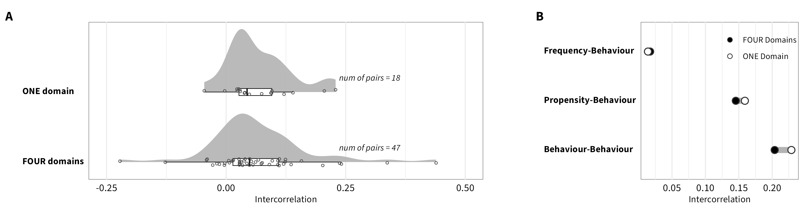
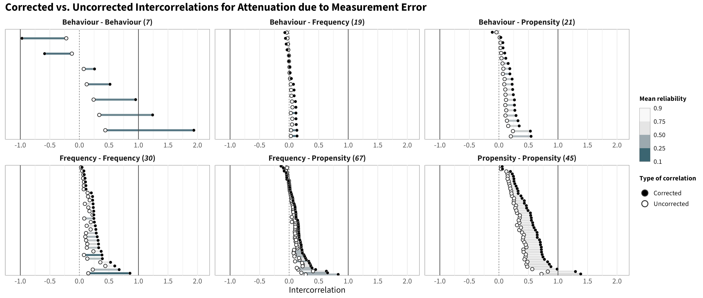

<!-- <style type="text/css"> -->

<!-- .main-container { -->

<!-- max-width: 1200px !important; -->

<!-- margin-left: auto; -->

<!-- margin-right: auto; -->

<!-- } -->

<!-- </style> -->

<!-- <style type="text/css"> -->

<!--   body{ -->

<!--   font-size: 12pt; -->

<!--   font-family: "Source Sans 3"; -->

<!-- } -->

<!-- </style> -->

```{r, include=FALSE}
knitr::opts_chunk$set(echo = FALSE, message = FALSE, warning = FALSE)

# options(width = 3000)

library(tidyverse)
library(kableExtra)
library(knitr)
library(ggdist)
library(brms)
library(patchwork)
library(posterior)
library(bayesplot)
library(ggplot2)
library(rstanarm)
library(data.table)
library(boot)
library(DT)
library(MetBrewer)
library(GGally)

model_path <- "/Volumes/CDS-Data/08_Projects/temprisk/analysis/output/convergent_val/"
color_scheme_set("teal")
source("/Volumes/CDS-Data/08_Projects/temprisk/helper_functions.R")

ma_list <- list(dom = readRDS(paste0(model_path, "fit_convergent_ma_domain.rds")),
                  categ = readRDS(paste0(model_path, "fit_convergent_ma_measure.rds")),
                  overall = readRDS(paste0(model_path, "fit_convergent_ma_overall.rds")))


```

## Brief Description

Below we provide information on the specifications of the Bayesian random-effects meta-analysis and meta-regressions, as well as an overview of the model summaries, including posterior predictive checks (PPCs), approximate leave-one-out (LOO) cross-validation output, and convergence diagnostics (i.e., Rhat values, trace plots, effective sample size).

***To replicate these analyses, refer to the [Workflow](https://cdsbasel.github.io/temprisk/workflow_overview.html) page***

<br>

## Bayesian random-effects meta-analysis and meta-regressions {.tabset}

### Intercept-Only {.tabset}

```{r, eval=TRUE, echo=FALSE}
fit_ma <- ma_list[["overall"]]
```

#### Model specification in `brms`

```{r, echo=TRUE, eval=FALSE}
family <- brmsfamily(
  family = "student", 
  link = "identity"
)

formula <-  bf(wcor_z|se(sei_z, sigma = TRUE) ~ 0 + Intercept + (1|sample),
               sigma ~ 0 + Intercept + (1 | sample))

priors <-  c(prior(normal(0, 1), class = "b", coef = "Intercept"),
             prior(normal(0, 2), class = "b", dpar = "sigma", coef = "Intercept"),
             prior(cauchy(0, 0.3), class = "sd"),
             prior(cauchy(0, 0.3), class = "sd", dpar = "sigma"))

```

#### Model Summary

```{r, eval=TRUE, echo=TRUE}
summary(fit_ma)
```

<br><br><br>

#### MCMC diagnostics

```{r, eval=TRUE, echo=FALSE, fig.height=4, fig.width=12}
p <- bayesplot::mcmc_trace(fit_ma, facet_args = list(ncol = 5), regex_pars = "^b|^sigma|^sd") 
p + theme_minimal() + theme(strip.text = element_text(size = 9.5, face = "bold"),
                            panel.background = element_rect(fill = "NA", color = "grey40", linewidth = .5),
                            text = element_text(size = 8.5),
                            title = element_text(size = 10, face = "bold")) + labs(title = "Trace Plots")

```

<br>

```{r, eval=TRUE, echo=FALSE, fig.height=4, fig.width=12}
plot_change_ess(fit_ma, variable = "^b|^sigma|^sd",
                regex = TRUE, 
                breaks = seq(0.1, 1, 0.05), 
                yaxis = "relative",
                ncol = 5) 
```

<br>

```{r, eval=TRUE, echo=FALSE, fig.height=2, fig.width=8}
plot_rhat(fit_ma, regex = "^b|^sigma|^sd") + labs(title = "Rhat")
```

<br><br><br>

#### PPCs & LOO

**Graphical posterior predictive checks**

```{r, eval=TRUE, echo=FALSE, fig.show="hold", out.width="33%"}
pp_check(fit_ma, ndraws = 50) + theme_minimal()  + theme(panel.background = element_rect(fill = "NA", color = "grey50", linewidth = .25))


pp_check(fit_ma,
         type ="stat",
         stat = "mean",
         ndraws = 1000,
         binwidth = .001) + theme_minimal() + theme(panel.background = element_rect(fill = "NA", color = "grey50", linewidth = .25))

pp_check(fit_ma,
         type ="stat",
         stat = "sd",
         ndraws = 1000,
         binwidth = .001) + theme_minimal()+ theme(panel.background = element_rect(fill = "NA", color = "grey50", linewidth = .25))

```

<br>

```{r, eval=TRUE, echo=FALSE, fig.show="hold", out.width="50%"}
model_loo <- loo(fit_ma, save_psis = TRUE)
model_loo
plot_psis_loo(model_loo)
w <- weights(model_loo$psis_object)
ppc_loo_pit_overlay(y = fit_ma$data$wcor,
                    yrep = posterior_predict(fit_ma),
                    lw = w) + theme_minimal() + labs(title = "LOO-PIT values") + theme(title = element_text(face = "bold", hjust = .5))
```

<br><br><br>

### Measure-Pair as Covariate {.tabset}

```{r, eval=TRUE, echo=FALSE}
fit_ma <- ma_list[["categ"]]
```

#### Model specification in `brms`

```{r, echo=TRUE, eval=FALSE}
family <- brmsfamily(
  family = "student", 
  link = "identity"
)

formula <-  bf(wcor_z|se(sei_z, sigma = TRUE) ~ 0 + meas_pair_id + (1|sample),
               sigma ~ 0 + meas_pair_id + (1|sample))

priors <-  c(prior(normal(0, 1), class = "b"),
             prior(normal(0, 2), class = "b", dpar = "sigma"),
             prior(cauchy(0, 0.3), class = "sd"),
             prior(cauchy(0, 0.3), class = "sd", dpar = "sigma"))
  
```

<br><br><br>

#### Model Summary

```{r, eval=TRUE, echo=TRUE}
summary(fit_ma)
```

<br><br><br>

#### MCMC diagnostics

```{r, eval=TRUE, echo=FALSE, fig.height=6, fig.width=12}
p <- bayesplot::mcmc_trace(fit_ma, facet_args = list(ncol = 5), regex_pars = "^b|^sigma|^sd") 
p + theme_minimal() + theme(strip.text = element_text(size = 9.5, face = "bold"),
                            panel.background = element_rect(fill = "NA", color = "grey40", linewidth = .5),
                            text = element_text(size = 8.5),
                            title = element_text(size = 10, face = "bold")) + labs(title = "Trace Plots")

```

<br>

```{r, eval=TRUE, echo=FALSE, fig.height=6, fig.width=12}
plot_change_ess(fit_ma, variable = "^b|^sigma|^sd",
                regex = TRUE, 
                breaks = seq(0.1, 1, 0.05), 
                yaxis = "relative",
                ncol = 5) 
```

<br>

```{r, eval=TRUE, echo=FALSE, fig.height=6, fig.width=12}
plot_rhat(fit_ma, regex = "^b|^sigma|^sd") + labs(title = "Rhat")
```

<br><br><br>

#### PPCs & LOO

**Graphical posterior predictive checks**

```{r, eval=TRUE, echo=FALSE, fig.show="hold", out.width="33%"}
pp_check(fit_ma, ndraws = 50) + theme_minimal()  + theme(panel.background = element_rect(fill = "NA", color = "grey50", linewidth = .25))


pp_check(fit_ma,
         type ="stat_grouped",
         stat = "mean",
         group = "meas_pair_id",
         binwidth = .001,
         ndraws = 1000) + theme_minimal() + theme(panel.background = element_rect(fill = "NA", color = "grey50", linewidth = .25))

pp_check(fit_ma,
         type ="stat_grouped",
         stat = "mean",
         group = "meas_pair_id",
         binwidth = .001,
         ndraws = 1000) + theme_minimal()+ theme(panel.background = element_rect(fill = "NA", color = "grey50", linewidth = .25))

```

<br>

```{r, eval=TRUE, echo=FALSE, fig.show="hold", out.width="50%"}
model_loo <- loo(fit_ma, save_psis = TRUE)
model_loo
plot_psis_loo(model_loo)
w <- weights(model_loo$psis_object)
ppc_loo_pit_overlay(y = fit_ma$data$wcor,
                    yrep = posterior_predict(fit_ma),
                    lw = w) + theme_minimal() + labs(title = "LOO-PIT values") + theme(title = element_text(face = "bold", hjust = .5))
```

<br><br><br>

### Domain-Pair as Covariate {.tabset}

```{r, eval=TRUE, echo=FALSE}
fit_ma <- ma_list[["dom"]]
```

#### Model specification in `brms`

```{r, echo=TRUE, eval=FALSE}

family <- brmsfamily(
  family = "student", 
  link = "identity")

formula <-  bf(wcor_z|se(sei_z, sigma = TRUE) ~ 0 + name_pair_id + (1|sample),
               sigma ~ 0 + name_pair_id + (1|sample))

priors <-  c(prior(normal(0, 0.5), class = "b"),
             prior(normal(0, 1), class = "b", dpar = "sigma"),
             prior(cauchy(0, 0.3), class = "sd"),
             prior(cauchy(0, 0.3), class = "sd", dpar = "sigma"))
  
```

<br><br><br>

#### Model Summary

```{r, eval=TRUE, echo=TRUE}
summary(fit_ma)
```

<br><br><br>

#### MCMC diagnostics

```{r, eval=TRUE, echo=FALSE, fig.height=60, fig.width=15}
p <- bayesplot::mcmc_trace(fit_ma, facet_args = list(ncol = 5), regex_pars = "^b|^sigma|^sd") 
p + theme_minimal() + theme(strip.text = element_text(size = 9.5, face = "bold"),
                            panel.background = element_rect(fill = "NA", color = "grey40", linewidth = .5),
                            text = element_text(size = 8.5),
                            title = element_text(size = 10, face = "bold")) + labs(title = "Trace Plots")

```

<br>

```{r, eval=TRUE, echo=FALSE, fig.height=60, fig.width=15}
plot_change_ess(fit_ma, variable = "^b|^sigma|^sd",
                regex = TRUE, 
                breaks = seq(0.1, 1, 0.05), 
                yaxis = "relative",
                ncol = 5) 
```

<br>

```{r, eval=TRUE, echo=FALSE, fig.height=40, fig.width=10}
plot_rhat(fit_ma, regex = "^b|^sigma|^sd") + labs(title = "Rhat")
```

<br><br><br>

#### PPCs & LOO

**Graphical posterior predictive checks**

```{r, eval=TRUE, echo=FALSE, fig.show="hold", out.width="33%"}
pp_check(fit_ma, ndraws = 50) + theme_minimal()  + theme(panel.background = element_rect(fill = "NA", color = "grey50", linewidth = .25))


pp_check(fit_ma,
         type ="stat",
         stat = "mean",
         ndraws = 1000,
         binwidth = .001) + theme_minimal() + theme(panel.background = element_rect(fill = "NA", color = "grey50", linewidth = .25))

pp_check(fit_ma,
         type ="stat",
         stat = "sd",
         ndraws = 1000,
         binwidth = .001) + theme_minimal()+ theme(panel.background = element_rect(fill = "NA", color = "grey50", linewidth = .25))

```

<br>

```{r, eval=TRUE, echo=FALSE, fig.show="hold", out.width="50%"}
model_loo <- loo(fit_ma, save_psis = TRUE)
model_loo
plot_psis_loo(model_loo)
w <- weights(model_loo$psis_object)
ppc_loo_pit_overlay(y = fit_ma$data$wcor,
                    yrep = posterior_predict(fit_ma),
                    lw = w) + theme_minimal() + labs(title = "LOO-PIT values") + theme(title = element_text(face = "bold", hjust = .5))
```

<br><br>

## Robustness Check

### Behavioural Measure Categorization 

We re-conducted the meta-analyses using a data set in which we treated behavioral measures as belonging to a single overarching "financial" domain (versus 4 domains: occupational, investment, gambling, and insurance). The overall estimate *(0.17, 95% HDI [0.15,0.20]; k = 4,810)* is comparable to the one reported in the main paper. Below are the correlation matrices of the results for this new categorization, as well as an additional figure comparing these re-calculated estimates to those reported in the matrices included the main paper

```{r, eval=TRUE, echo=FALSE}
knitr::include_graphics("images/cor_matrix_fig_beh_agg.png")
```


<br>

```{r, eval=TRUE, echo=FALSE}

```


<br><br>

##  Attenuation

We corrected the 189 meta-analytic estimates of the intercorrelations reported in the main paper for attenuation due to measurement error by using the MASC reliability parameter estimates and Spearman's formula. 

$$r_{true} = \frac{r_{obs}}{\sqrt{rel_{1}*rel_{2}}}$$

Below are the matrices with the correlations corrected for attenuation (any correlation exceeding |1.00| was capped at |1.00|). We additionally provide a figure below, which contrasts the corrected and uncorrected intercorrelations for each measure pair faceted by category pair.

⚠️ As expected, the results show overall increased correlations between measures. We observe a correlation of rho = 0.95 between the corrected and uncorrected intercorrelations, which indicates that the overall ranking of associations is largely preserved. However, as shown in the figure, the magnitude of the correction is a function of the initial (low) reliability of measures, with those pairs that include measures with low reliability receiving stronger corrections, as it is the case, for example, for behavior-behavior correlations. As a consequence, **reporting corrected intercorrelations may “inflate” intercorrelations for some measure categories, introducing a systematic bias and providing an incorrect view of the actual observed intercorrelations between measures**. As a result, we opted to report the non-corrected values in the manuscript and provide information about corrections for attenuation in the supplementary materials.⚠️

```{r, eval=TRUE, echo=FALSE}
knitr::include_graphics("images/cor_matrix_fig_correction.png")
```

<br>

```{r, eval=TRUE, echo=FALSE}

```


<br><br>
