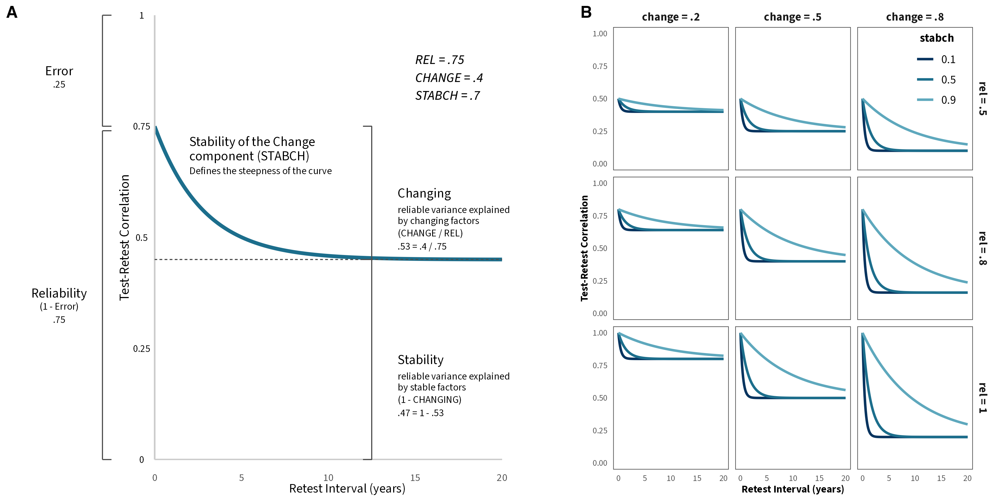
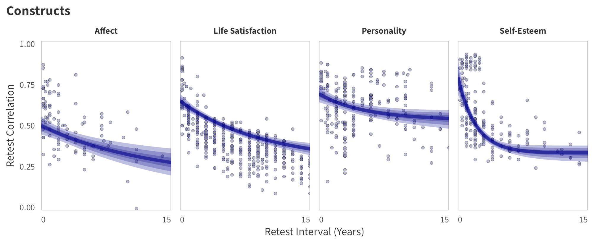

<!-- <style type="text/css"> -->
<!-- .main-container { -->
<!-- max-width: 1200px !important; -->
<!-- margin-left: auto; -->
<!-- margin-right: auto; -->
<!-- } -->
<!-- </style> -->


<!-- <style type="text/css"> -->
<!--   body{ -->
<!--   font-size: 12pt; -->
<!--   font-family: "Source Sans 3"; -->
<!-- } -->
<!-- </style> -->


```{r, include=FALSE}
knitr::opts_chunk$set(echo = FALSE, message = FALSE, warning = FALSE)

# options(width = 3000)

library(tidyverse)
library(kableExtra)
library(knitr)
library(ggdist)
library(brms)
library(patchwork)
library(posterior)
library(bayesplot)
library(ggplot2)
library(rstanarm)
library(data.table)
library(boot)
library(DT)
library(GGally)
library(MetBrewer)
library(gt)

data_w_path <- "/Volumes/CDS-Data/08_Projects/temprisk/processing/output/temp_stability/" 
model_path <- "/Volumes/CDS-Data/08_Projects/temprisk/analysis/output/temp_stability/"
color_scheme_set("teal")
source("/Volumes/CDS-Data/08_Projects/temprisk/helper_functions.R")


masc_list <- list(fre = readRDS(paste0(model_path, "masc_fre.rds")),
                  pro = readRDS(paste0(model_path, "masc_pro.rds")),
                  beh = readRDS(paste0(model_path, "masc_beh.rds")),
                  as =  readRDS(paste0(model_path, "masc_as.rds")))


```


## Brief Description

We used the Meta-Analytic Stability and Change model (Anusic & Schimmack, 2015) to describe the trajectory of the test-retest correlations of risk preference over time.

<br>

$$
\begin{aligned}
Y_{t2-t1} = rel \times \ (change \times \ (stabch^{time}  - 1) + 1)
\end{aligned}
$$

<br>

$Y_{t2-t1}$ : test-retest correlation for a specific time interval (i.e., number of years between t1 and t2)

$rel$ : proportion of reliable variance

$change$ : proportion of reliable variance explained by changing factors

$stabch$ : the stability of the changing factors over time (per year)

$time$ :  number of years between t1 and t2

<br>

<br>

```{r, fig.cap= "Illustration of MASC parameters. Adapted from Anusic and Schimack, 2015"}

```


<br>


Below, we provide information on the model specifications and an overview of the model summaries, including posterior predictive checks (PPCs), approximate leave-one-out (LOO) cross-validation output, and convergence diagnostics (i.e., rhat values, trace plots, effective sample size). We fitted the same model separately to the set of test-retest correlations for each risk preference measure category (i.e., propensity, frequency, and behavior).


***To replicate these analyses, refer to the [Workflow](https://cdsbasel.github.io/temprisk/workflow_overview.html) page***

<br>


## Model specification in `brms` 

```{r, eval=FALSE, echo=TRUE}

# specify family
family <- brmsfamily(
  family = "student", 
  link = "identity"
)


# formula
formula <- bf(
  wcor | se(sei, sigma = TRUE) ~ rel * ((1-change) + (change) * (stabch^time_diff_dec)),  
  nlf(rel ~ inv_logit(logitrel)),
  nlf(change ~ inv_logit(logitchange)),
  nlf(stabch ~ inv_logit(logitstabch)),
  logitrel ~ 1 + domain_name*age_dec_c + domain_name*age_dec_c2  + female_prop_c +
    (1 + age_dec_c + age_dec_c2 + female_prop_c | panel),
  logitchange ~ 1+ domain_name*age_dec_c + domain_name*age_dec_c2 + female_prop_c, 
  logitstabch ~ 1+ domain_name*age_dec_c + domain_name*age_dec_c2  + female_prop_c, 
  nl = TRUE
)


# weakly informative priors
priors <-
  prior(normal(0, 1), nlpar="logitrel", class = "b") +
  prior(normal(0, 1), nlpar="logitchange", class = "b") +
  prior(normal(0, 1), nlpar="logitstabch", class = "b") +
  prior(cauchy(0, 1), nlpar="logitrel", class = "sd")  +
  prior(cauchy(0, 1), class = "sigma")  +
  prior(lkj(1), group="sample", class = "L") 

```


<br><br><br>


## Fitted Models: Risk Preference {.tabset}

### Propensity {.tabset}
```{r, eval=TRUE, echo=FALSE}
fit_masc <- masc_list[["pro"]]
```


#### Model Summary  {.tabset}

##### `brms` output

```{r, eval=TRUE, echo=TRUE}
summary(fit_masc)
```


<br><br><br>

#### MCMC diagnostics {.tabset}

##### logitrel parameter


```{r, eval=TRUE, echo=FALSE, fig.height=13, fig.width=16}
p <- bayesplot::mcmc_trace(fit_masc, facet_args = list(ncol = 5), regex_pars = "^b_logitrel") 
p + theme_minimal() + theme(strip.text = element_text(size = 9.5, face = "bold"),
                            panel.background = element_rect(fill = "NA", color = "grey40", linewidth = .5),
                            text = element_text(size = 8.5),
                            title = element_text(size = 12, face = "bold")) + labs(title = "Trace Plots")

```


<br>

```{r, eval=TRUE, echo=FALSE, fig.height=13, fig.width=16}
plot_change_ess(fit_masc, variable = "^b_logitrel",
                regex = TRUE, 
                breaks = seq(0.1, 1, 0.05), 
                yaxis = "relative",
                ncol = 5) 
```

<br>


```{r, eval=TRUE, echo=FALSE, fig.height=7, fig.width=10}
plot_rhat(fit_masc, regex = "^b_logitrel") + labs(title = "Rhat")
```


<br><br><br>

##### logitchange parameter

```{r, eval=TRUE, echo=FALSE, fig.height=13, fig.width=16}
p <- bayesplot::mcmc_trace(fit_masc, facet_args = list(ncol = 5), regex_pars = "^b_logitchange") 
p + theme_minimal() + theme(strip.text = element_text(size = 9.5, face = "bold"),
                            panel.background = element_rect(fill = "NA", color = "grey40", linewidth = .5),
                            text =element_text(size = 8.5), title = element_text(size = 12, face = "bold")) + labs(title = "Trace Plots")

```


<br>

```{r, eval=TRUE, echo=FALSE, fig.height=13, fig.width=16}
plot_change_ess(fit_masc, variable = "^b_logitchange",
                regex = TRUE, 
                breaks = seq(0.1, 1, 0.05), 
                yaxis = "relative",
                ncol = 5) 
```

<br>


```{r, eval=TRUE, echo=FALSE, fig.height=7, fig.width=10}
plot_rhat(fit_masc, regex = "^b_logitchange") + labs(title = "Rhat")
```


<br><br><br>


##### logitstabch parameter

```{r, eval=TRUE, echo=FALSE, fig.height=13, fig.width=16}
p <- bayesplot::mcmc_trace(fit_masc, facet_args = list(ncol = 5), regex_pars = "^b_logitstabch") 
p + theme_minimal() + theme(strip.text = element_text(size = 9.5, face = "bold"),
                            panel.background = element_rect(fill = "NA", color = "grey40", linewidth = .5),
                            text =element_text(size = 8.5), title = element_text(size = 12, face = "bold")) + labs(title = "Trace Plots")

```


<br>

```{r, eval=TRUE, echo=FALSE, fig.height=13, fig.width=16}
plot_change_ess(fit_masc, variable = "^b_logitstabch",
                regex = TRUE, 
                breaks = seq(0.1, 1, 0.05), 
                yaxis = "relative",
                ncol = 5) 
```

<br>


```{r, eval=TRUE, echo=FALSE, fig.height=7, fig.width=10}
plot_rhat(fit_masc, regex = "^b_logitstabch") + labs(title = "Rhat")
```


<br><br><br>


##### Random Structure


```{r, eval=TRUE, echo=FALSE, fig.height=5, fig.width=15}
p <- bayesplot::mcmc_trace(fit_masc, facet_args = list(ncol = 5), regex_pars = "^sd|^cor") 
p + theme_minimal() + theme(strip.text = element_text(size = 9.5, face = "bold"),
                            panel.background = element_rect(fill = "NA", color = "grey40", linewidth = .5),
                            text =element_text(size = 8.5), title = element_text(size = 12, face = "bold")) + labs(title = "Trace Plots")

```


<br>

```{r, eval=TRUE, echo=FALSE, fig.height=5, fig.width=15}
plot_change_ess(fit_masc, variable = "^sd|^cor",
                regex = TRUE, 
                breaks = seq(0.1, 1, 0.05), 
                yaxis = "relative",
                ncol = 5) 
```

<br>


```{r, eval=TRUE, echo=FALSE, fig.height=3, fig.width=10}
plot_rhat(fit_masc, regex = "^sd|^cor") + labs(title = "Rhat")
```


<br><br><br>


#### PPCs & LOO

**Graphical posterior predictive checks**

```{r, eval=TRUE, echo=FALSE, fig.show="hold", out.width="50%"}
pp_check(fit_masc,
         type ="stat_grouped",
         stat = "mean",
         group = "domain_name",
         ndraws = 1000) + theme_minimal() + theme(panel.background = element_rect(fill = "NA", color = "grey50", linewidth = .25))
pp_check(fit_masc,
         type ="stat_grouped",
         stat = "sd",
         group = "domain_name",
         ndraws = 1000) + theme_minimal() + theme(panel.background = element_rect(fill = "NA", color = "grey50", linewidth = .25))
```


<br>

```{r, eval=TRUE, echo=FALSE, fig.show="hold", out.width="50%"}
model_loo <- loo(fit_masc, save_psis = TRUE)
model_loo
plot_psis_loo(model_loo)
w <- weights(model_loo$psis_object)
ppc_loo_pit_overlay(y = fit_masc$data$wcor,
                    yrep = posterior_predict(fit_masc),
                    lw = w) + theme_minimal() + labs(title = "LOO-PIT values") + theme(title = element_text(face = "bold", hjust = .5))
```


<br><br><br>


#### By-Panel Predictions {.tabset}

In the tabs are panel-specific predictions for the trajectory of  domain-specific test-retest correlations over time *(predictions based on the weighted median age of the sample, 50% female)*.

```{r, results="asis"}

file_list <- tibble(file_path =
                      list.files(path = "images", pattern = "p_masc_panel_pred_pro", recursive = TRUE, full.names = TRUE))  %>% 
  rowwise() %>% 
  mutate(tab_name = substring(file_path,30, nchar(file_path)-4),
                tab_name = case_when(tab_name == "rel_param" ~ "Reliability Parameter",
                              TRUE ~ rename_domain(tab_name)))
tabs <- unique(file_list$tab_name)

tabs <- c(tabs[tabs =="Reliability Parameter"], tabs[tabs != "Reliability Parameter"])

# set loop for tabs

for(curr_tab in tabs){
  
  
  cat("##### ", curr_tab, "\n") # 
  
  cat("\n", "</center>", "\n")
  
  cat(paste0("{width=100%}"))
  
  cat("\n", "</center>", "\n")
  
  cat("<br><br><br>")
  
  cat("\n\n\n\n")
}
```


<br><br><br>


### Frequency {.tabset}
```{r, eval=TRUE, echo=FALSE}
fit_masc <- masc_list[["fre"]]
```

#### Model Summary {.tabset} 


##### `brms` output

```{r, eval=TRUE, echo=TRUE}
summary(fit_masc)
```


<br><br><br>


#### MCMC diagnostics {.tabset}

##### logitrel parameter


```{r, eval=TRUE, echo=FALSE, fig.height=10, fig.width=16}
p <- bayesplot::mcmc_trace(fit_masc, facet_args = list(ncol = 5), regex_pars = "^b_logitrel") 
p + theme_minimal() + theme(strip.text = element_text(size = 9.5, face = "bold"),
                            panel.background = element_rect(fill = "NA", color = "grey40", linewidth = .5),
                            text = element_text(size = 8.5),
                            title = element_text(size = 12, face = "bold")) + labs(title = "Trace Plots")

```


<br>

```{r, eval=TRUE, echo=FALSE, fig.height=10, fig.width=16}
plot_change_ess(fit_masc, variable = "^b_logitrel",
                regex = TRUE, 
                breaks = seq(0.1, 1, 0.05), 
                yaxis = "relative",
                ncol = 5) 
```

<br>


```{r, eval=TRUE, echo=FALSE, fig.height=6,fig.width=10}
plot_rhat(fit_masc, regex = "^b_logitrel") + labs(title = "Rhat")
```


<br><br><br>

##### logitchange parameter

```{r, eval=TRUE, echo=FALSE, fig.height=10, fig.width=16}
p <- bayesplot::mcmc_trace(fit_masc, facet_args = list(ncol = 5), regex_pars = "^b_logitchange") 
p + theme_minimal() + theme(strip.text = element_text(size = 9.5, face = "bold"),
                            panel.background = element_rect(fill = "NA", color = "grey40", linewidth = .5),
                            text =element_text(size = 8.5), title = element_text(size = 12, face = "bold")) + labs(title = "Trace Plots")

```


<br>

```{r, eval=TRUE, echo=FALSE, fig.height=10, fig.width=16}
plot_change_ess(fit_masc, variable = "^b_logitchange",
                regex = TRUE, 
                breaks = seq(0.1, 1, 0.05), 
                yaxis = "relative",
                ncol = 5) 
```

<br>


```{r, eval=TRUE, echo=FALSE, fig.height=6,fig.width=10}
plot_rhat(fit_masc, regex = "^b_logitchange") + labs(title = "Rhat")
```


<br><br><br>


##### logitstabch parameter

```{r, eval=TRUE, echo=FALSE, fig.height=10, fig.width=16}
p <- bayesplot::mcmc_trace(fit_masc, facet_args = list(ncol = 5), regex_pars = "^b_logitstabch") 
p + theme_minimal() + theme(strip.text = element_text(size = 9.5, face = "bold"),
                            panel.background = element_rect(fill = "NA", color = "grey40", linewidth = .5),
                            text =element_text(size = 8.5), title = element_text(size = 12, face = "bold")) + labs(title = "Trace Plots")

```


<br>

```{r, eval=TRUE, echo=FALSE, fig.height=10, fig.width=16}
plot_change_ess(fit_masc, variable = "^b_logitstabch",
                regex = TRUE, 
                breaks = seq(0.1, 1, 0.05), 
                yaxis = "relative",
                ncol = 5) 
```

<br>


```{r, eval=TRUE, echo=FALSE, fig.height=6,fig.width=10}
plot_rhat(fit_masc, regex = "^b_logitstabch") + labs(title = "Rhat")
```


<br><br><br>


##### Random Structure


```{r, eval=TRUE, echo=FALSE, fig.height=5, fig.width=15}
p <- bayesplot::mcmc_trace(fit_masc, facet_args = list(ncol = 5), regex_pars = "^sd|^cor") 
p + theme_minimal() + theme(strip.text = element_text(size = 9.5, face = "bold"),
                            panel.background = element_rect(fill = "NA", color = "grey40", linewidth = .5),
                            text =element_text(size = 8.5), title = element_text(size = 12, face = "bold")) + labs(title = "Trace Plots")

```


<br>

```{r, eval=TRUE, echo=FALSE, fig.height=5, fig.width=15}
plot_change_ess(fit_masc, variable = "^sd|^cor",
                regex = TRUE, 
                breaks = seq(0.1, 1, 0.05), 
                yaxis = "relative",
                ncol = 5) 
```

<br>


```{r, eval=TRUE, echo=FALSE, fig.height=3, fig.width=10}
plot_rhat(fit_masc, regex = "^sd|^cor") + labs(title = "Rhat")
```


<br><br><br>


#### PPCs & LOO

**Graphical posterior predictive checks**

```{r, eval=TRUE, echo=FALSE, fig.show="hold", out.width="50%"}
pp_check(fit_masc,
         type ="stat_grouped",
         stat = "mean",
         group = "domain_name",
         ndraws = 1000) + theme_minimal() + theme(panel.background = element_rect(fill = "NA", color = "grey50", linewidth = .25))
pp_check(fit_masc,
         type ="stat_grouped",
         stat = "sd",
         group = "domain_name",
         ndraws = 1000) + theme_minimal() + theme(panel.background = element_rect(fill = "NA", color = "grey50", linewidth = .25))
```


<br>


```{r, eval=TRUE, echo=FALSE, fig.show="hold", out.width="50%"}
model_loo <- loo(fit_masc, save_psis = TRUE)
model_loo
plot_psis_loo(model_loo)
w <- weights(model_loo$psis_object)
ppc_loo_pit_overlay(y = fit_masc$data$wcor,
                    yrep = posterior_predict(fit_masc),
                    lw = w) + theme_minimal() + labs(title = "LOO-PIT values") + theme(title = element_text(face = "bold", hjust = .5))
```


<br><br><br>


#### By-Panel Predictions {.tabset}

In tabs are panel-specific predictions for the trajectory of  domain-specific test-retest correlations over time *(predictions based on the weighted median age of the sample, 50% female)*.


```{r, results="asis"}

file_list <- tibble(file_path =
                      list.files(path = "images", pattern = "p_masc_panel_pred_fre", recursive = TRUE, full.names = TRUE))  %>%
  rowwise() %>%
mutate(tab_name = substring(file_path,30, nchar(file_path)-4),
         tab_name = case_when(tab_name == "rel_param" ~ "Reliability Parameter",
                              TRUE ~ rename_domain(tab_name)))

tabs <- unique(file_list$tab_name)

tabs <- c(tabs[tabs =="Reliability Parameter"], tabs[tabs != "Reliability Parameter"])

# set loop for tabs

for(curr_tab in tabs){
  
  
  cat("##### ", curr_tab, "\n") #
  
  cat("\n", "</center>", "\n")
  
  cat(paste0("{width=100%}"))
  
  
  cat("\n", "</center>", "\n")
  
  cat("<br><br><br>")
  
  cat("\n\n\n\n")
}
```


<br><br><br>


### Behaviour {.tabset}
```{r, eval=TRUE, echo=FALSE}
fit_masc <- masc_list[["beh"]]
```

#### Model Summary {.tabset}


##### `brms` output

```{r, eval=TRUE, echo=TRUE}
summary(fit_masc)
```


<br><br><br>


#### MCMC diagnostics {.tabset}

##### logitrel parameter


```{r, eval=TRUE, echo=FALSE, fig.height=7, fig.width=16}
p <- bayesplot::mcmc_trace(fit_masc, facet_args = list(ncol = 5), regex_pars = "^b_logitrel") 
p + theme_minimal() + theme(strip.text = element_text(size = 9.5, face = "bold"),
                            panel.background = element_rect(fill = "NA", color = "grey40", linewidth = .5),
                            text = element_text(size = 8.5),
                            title = element_text(size = 12, face = "bold")) + labs(title = "Trace Plots")

```


<br>

```{r, eval=TRUE, echo=FALSE, fig.height=7, fig.width=16}
plot_change_ess(fit_masc, variable = "^b_logitrel",
                regex = TRUE, 
                breaks = seq(0.1, 1, 0.05), 
                yaxis = "relative",
                ncol = 5) 
```

<br>


```{r, eval=TRUE, echo=FALSE, fig.height=5, fig.width=10}
plot_rhat(fit_masc, regex = "^b_logitrel") + labs(title = "Rhat")
```


<br><br><br>

##### logitchange parameter

```{r, eval=TRUE, echo=FALSE, fig.height=7, fig.width=16}
p <- bayesplot::mcmc_trace(fit_masc, facet_args = list(ncol = 5), regex_pars = "^b_logitchange") 
p + theme_minimal() + theme(strip.text = element_text(size = 9.5, face = "bold"),
                            panel.background = element_rect(fill = "NA", color = "grey40", linewidth = .5),
                            text = element_text(size = 8.5), title = element_text(size = 12, face = "bold")) + labs(title = "Trace Plots")

```


<br>

```{r, eval=TRUE, echo=FALSE, fig.height=7, fig.width=16}
plot_change_ess(fit_masc, variable = "^b_logitchange",
                regex = TRUE, 
                breaks = seq(0.1, 1, 0.05), 
                yaxis = "relative",
                ncol = 5) 
```

<br>


```{r, eval=TRUE, echo=FALSE, fig.height=5, fig.width=10}
plot_rhat(fit_masc, regex = "^b_logitchange") + labs(title = "Rhat")
```


<br><br><br>


##### logitstabch parameter

```{r, eval=TRUE, echo=FALSE, fig.height=7, fig.width=16}
p <- bayesplot::mcmc_trace(fit_masc, facet_args = list(ncol = 5), regex_pars = "^b_logitstabch") 
p + theme_minimal() + theme(strip.text = element_text(size = 9.5, face = "bold"),
                            panel.background = element_rect(fill = "NA", color = "grey40", linewidth = .5),
                            text =element_text(size = 8.5), title = element_text(size = 12, face = "bold")) + labs(title = "Trace Plots")

```


<br>

```{r, eval=TRUE, echo=FALSE, fig.height=7, fig.width=16}
plot_change_ess(fit_masc, variable = "^b_logitstabch",
                regex = TRUE, 
                breaks = seq(0.1, 1, 0.05), 
                yaxis = "relative",
                ncol = 5) 
```

<br>


```{r, eval=TRUE, echo=FALSE, fig.height=5, fig.width=10}
plot_rhat(fit_masc, regex = "^b_logitstabch") + labs(title = "Rhat")
```


<br><br><br>


##### Random Structure


```{r, eval=TRUE, echo=FALSE, fig.height=7, fig.width=15}
p <- bayesplot::mcmc_trace(fit_masc, facet_args = list(ncol = 5), regex_pars = "^sd|^cor") 
p + theme_minimal() + theme(strip.text = element_text(size = 9.5, face = "bold"),
                            panel.background = element_rect(fill = "NA", color = "grey40", linewidth = .5),
                            text =element_text(size = 8.5), title = element_text(size = 12, face = "bold")) + labs(title = "Trace Plots")

```


<br>

```{r, eval=TRUE, echo=FALSE, fig.height=7, fig.width=15}
plot_change_ess(fit_masc, variable = "^sd|^cor",
                regex = TRUE, 
                breaks = seq(0.1, 1, 0.05), 
                yaxis = "relative",
                ncol = 5) 
```

<br>


```{r, eval=TRUE, echo=FALSE, fig.height=4, fig.width=10}
plot_rhat(fit_masc, regex = "^sd|^cor") + labs(title = "Rhat")
```


<br><br><br>


#### PPCs & LOO

**Graphical posterior predictive checks**

```{r, eval=TRUE, echo=FALSE, fig.show="hold", out.width="50%"}
pp_check(fit_masc,
         type ="stat_grouped",
         stat = "mean",
         group = "domain_name",
         ndraws = 1000) + theme_minimal() + theme(panel.background = element_rect(fill = "NA", color = "grey50", linewidth = .25))

pp_check(fit_masc,
         type ="stat_grouped",
         stat = "sd",
         group = "domain_name",
         ndraws = 1000) + theme_minimal() + theme(panel.background = element_rect(fill = "NA", color = "grey50", linewidth = .25))
```


<br>


```{r, eval=TRUE, echo=FALSE, fig.show="hold", out.width="50%"}
model_loo <- loo(fit_masc, save_psis = TRUE)
model_loo
plot_psis_loo(model_loo)
w <- weights(model_loo$psis_object)
ppc_loo_pit_overlay(y = fit_masc$data$wcor,
                    yrep = posterior_predict(fit_masc),
                    lw = w) + theme_minimal() + labs(title = "LOO-PIT values") + theme(title = element_text(face = "bold", hjust = .5))
```


<br><br><br>


#### By-Panel Predictions {.tabset}

In tabs are panel-specific predictions for the trajectory of  domain-specific test-retest correlations over time *(predictions based on the weighted median age of the sample, 50% female)*.


```{r, results="asis"}

file_list <- tibble(file_path =
                      list.files(path = "images", pattern = "p_masc_panel_pred_beh", recursive = TRUE, full.names = TRUE))  %>%
  rowwise() %>%
  mutate(tab_name = substring(file_path,30, nchar(file_path)-4),
                tab_name = case_when(tab_name == "rel_param" ~ "Reliability Parameter",
                              TRUE ~ rename_domain(tab_name)))

tabs <- unique(file_list$tab_name)

tabs <- c(tabs[tabs =="Reliability Parameter"], tabs[tabs != "Reliability Parameter"])

# set loop for tabs

for(curr_tab in tabs){
  
  
  cat("##### ", curr_tab, "\n") #
  
  cat("\n", "</center>", "\n")
  
  cat(paste0("{width=100%}"))
  
  
  cat("\n", "</center>", "\n")
  
  cat("<br><br><br>")
  
  cat("\n\n\n\n")
  
}
```


<br><br><br>


## Fitted Model: Anusic & Schimmack (2015) {.tabset}

```{r, eval=TRUE, echo=FALSE}
fit_masc <- masc_list[["as"]]
```

### Model Specfication 

For the modeling of the *reliability* parameter we did not include a random structure given that in this dataset close to 70% of the studies/samples had 4 or less observations. This results in a lack of response variability within each study/sample, and can be problematic for  model convergence, as well as the estimation of random intercepts and slopes.


```{r, eval=FALSE, echo=TRUE}

# specify family
family <- brmsfamily(
  family = "student", 
  link = "identity"
)


# formula
formula <- bf(
  wcor | se(se, sigma = TRUE) ~ rel * ((1-change) + (change) * (stabch^time_diff_dec)),  #
  nlf(rel ~ inv_logit(logitrel)),
  nlf(change ~ inv_logit(logitchange)),
  nlf(stabch ~ inv_logit(logitstabch)),
  logitrel ~ 1 + construct*age_dec_c + construct*age_dec_c2  + female_prop_c,
  logitchange ~ 1+ construct*age_dec_c + construct*age_dec_c2 + female_prop_c, 
  logitstabch ~ 1+ construct*age_dec_c + construct*age_dec_c2  + female_prop_c, 
  nl = TRUE
)


# weakly informative priors
priors <-
  prior(normal(0,1), nlpar="logitrel", class = "b") +
  prior(normal(0,1), nlpar="logitchange", class = "b") +
  prior(normal(0,1), nlpar="logitstabch", class = "b") +
  prior(normal(0,1),  class = "sigma")

```


### Model Summary {.tabset}


#### `brms` output

```{r, eval=TRUE, echo=TRUE}
summary(fit_masc)
```


### MCMC diagnostics {.tabset}

#### logitrel parameter


```{r, eval=TRUE, echo=FALSE, fig.height=8, fig.width=16}
p <- bayesplot::mcmc_trace(fit_masc, facet_args = list(ncol = 5), regex_pars = "^b_logitrel") 
p + theme_minimal() + theme(strip.text = element_text(size = 9.5, face = "bold"),
                            panel.background = element_rect(fill = "NA", color = "grey40", linewidth = .5),
                            text = element_text(size = 8.5),
                            title = element_text(size = 12, face = "bold")) + labs(title = "Trace Plots")

```


<br>

```{r, eval=TRUE, echo=FALSE, fig.height=8, fig.width=16}
plot_change_ess(fit_masc, variable = "^b_logitrel",
                regex = TRUE, 
                breaks = seq(0.1, 1, 0.05), 
                yaxis = "relative",
                ncol = 5) 
```

<br>


```{r, eval=TRUE, echo=FALSE, fig.height=5, fig.width=10}
plot_rhat(fit_masc, regex = "^b_logitrel") + labs(title = "Rhat")
```


<br><br><br>

#### logitchange parameter

```{r, eval=TRUE, echo=FALSE, fig.height=8, fig.width=16}
p <- bayesplot::mcmc_trace(fit_masc, facet_args = list(ncol = 5), regex_pars = "^b_logitchange") 
p + theme_minimal() + theme(strip.text = element_text(size = 9.5, face = "bold"),
                            panel.background = element_rect(fill = "NA", color = "grey40", linewidth = .5),
                            text =element_text(size = 8.5), title = element_text(size = 12, face = "bold")) + labs(title = "Trace Plots")

```


<br>

```{r, eval=TRUE, echo=FALSE, fig.height=8, fig.width=16}
plot_change_ess(fit_masc, variable = "^b_logitchange",
                regex = TRUE, 
                breaks = seq(0.1, 1, 0.05), 
                yaxis = "relative",
                ncol = 5) 
```

<br>


```{r, eval=TRUE, echo=FALSE, fig.height=5, fig.width=10}
plot_rhat(fit_masc, regex = "^b_logitchange") + labs(title = "Rhat")
```


<br><br><br>


#### logitstabch parameter

```{r, eval=TRUE, echo=FALSE, fig.height=8, fig.width=16}
p <- bayesplot::mcmc_trace(fit_masc, facet_args = list(ncol = 5), regex_pars = "^b_logitstabch") 
p + theme_minimal() + theme(strip.text = element_text(size = 9.5, face = "bold"),
                            panel.background = element_rect(fill = "NA", color = "grey40", linewidth = .5),
                            text =element_text(size = 8.5), title = element_text(size = 12, face = "bold")) + labs(title = "Trace Plots")

```


<br>

```{r, eval=TRUE, echo=FALSE, fig.height=8, fig.width=16}
plot_change_ess(fit_masc, variable = "^b_logitstabch",
                regex = TRUE, 
                breaks = seq(0.1, 1, 0.05), 
                yaxis = "relative",
                ncol = 5) 
```

<br>


```{r, eval=TRUE, echo=FALSE, fig.height=5, fig.width=10}
plot_rhat(fit_masc, regex = "^b_logitstabch") + labs(title = "Rhat")
```


<br><br><br>


#### Random Structure

**NOT APPLICABLE**

<br><br><br>


### PPCs & LOO

**Graphical posterior predictive checks**


```{r, eval=TRUE, echo=FALSE, fig.show="hold", out.width="50%"}
pp_check(fit_masc,
         type ="stat_grouped",
         stat = "mean",
         group = "construct",
         ndraws = 1000) + theme_minimal() + theme(panel.background = element_rect(fill = "NA", color = "grey50", linewidth = .25)) 
pp_check(fit_masc,
         type ="stat_grouped",
         stat = "sd",
         group = "construct",
         ndraws = 1000) + theme_minimal() + theme(panel.background = element_rect(fill = "NA", color = "grey50", linewidth = .25))
```


<br>


```{r, eval=TRUE, echo=FALSE, fig.show="hold", out.width="50%", message=FALSE}
model_loo <- loo(fit_masc, save_psis = TRUE)
model_loo
plot_psis_loo(model_loo)
w <- weights(model_loo$psis_object)
ppc_loo_pit_overlay(y = fit_masc$data$retest,
                    yrep = posterior_predict(fit_masc),
                    lw = w) + theme_minimal() + labs(title = "LOO-PIT values") + theme(title = element_text(face = "bold", hjust = .5))
```


<br><br><br>


### By-Construct Predictions
Construct-specific predictions for the trajectory of test-retest correlations over time *(predictions based on the weighted mean age of the respondents for each construct, 50% female)*.

```{r, fig.width=10, fig.height=5}

```

