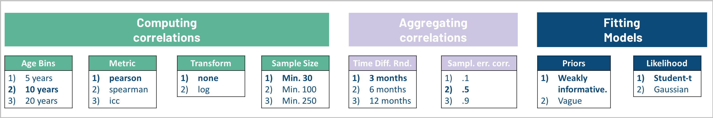
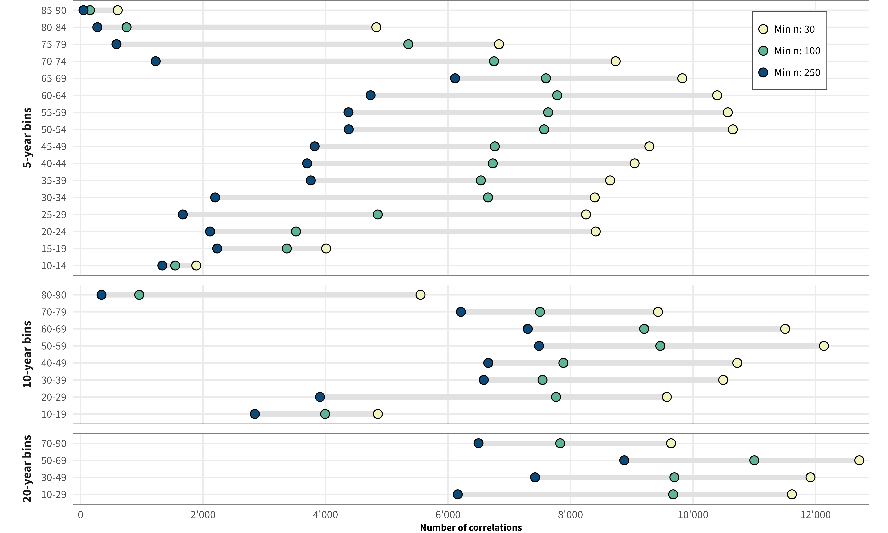
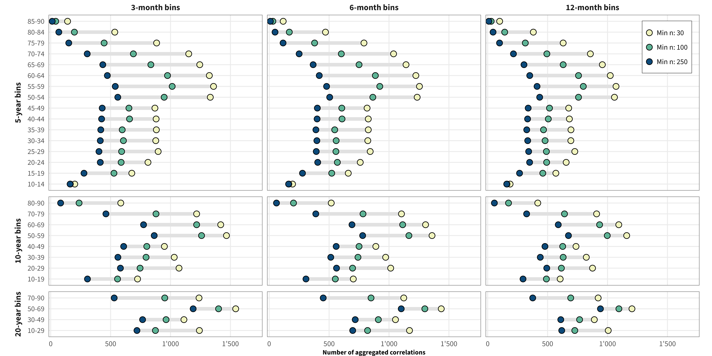
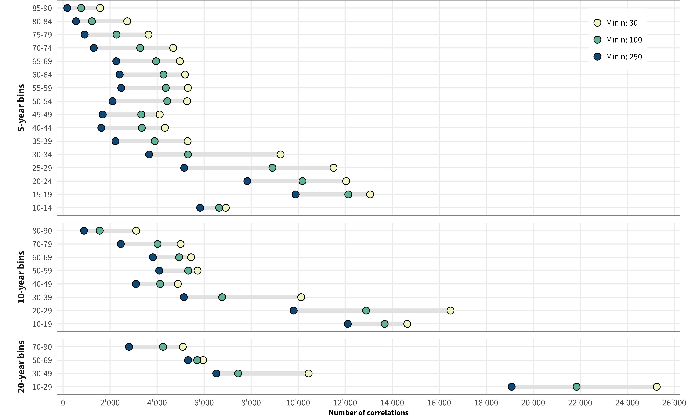
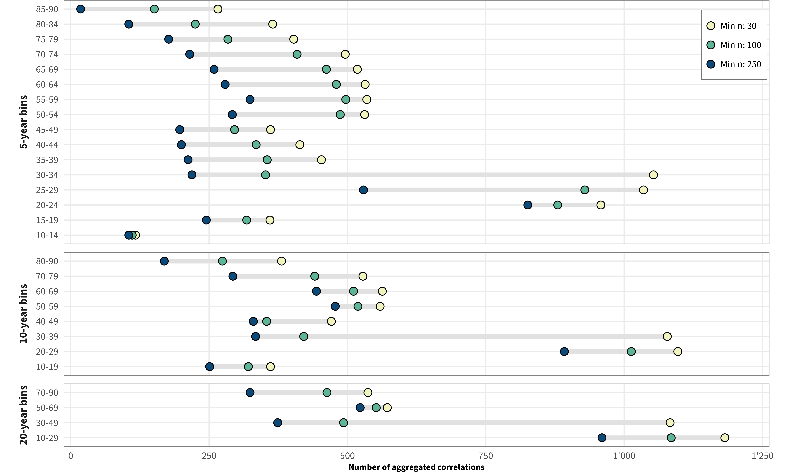
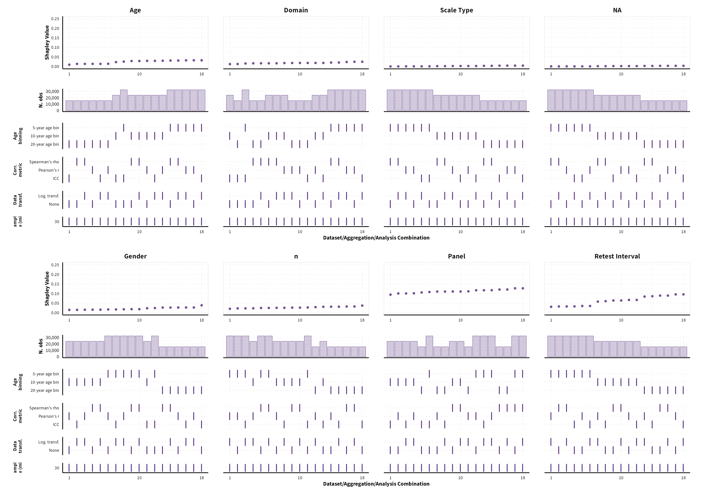
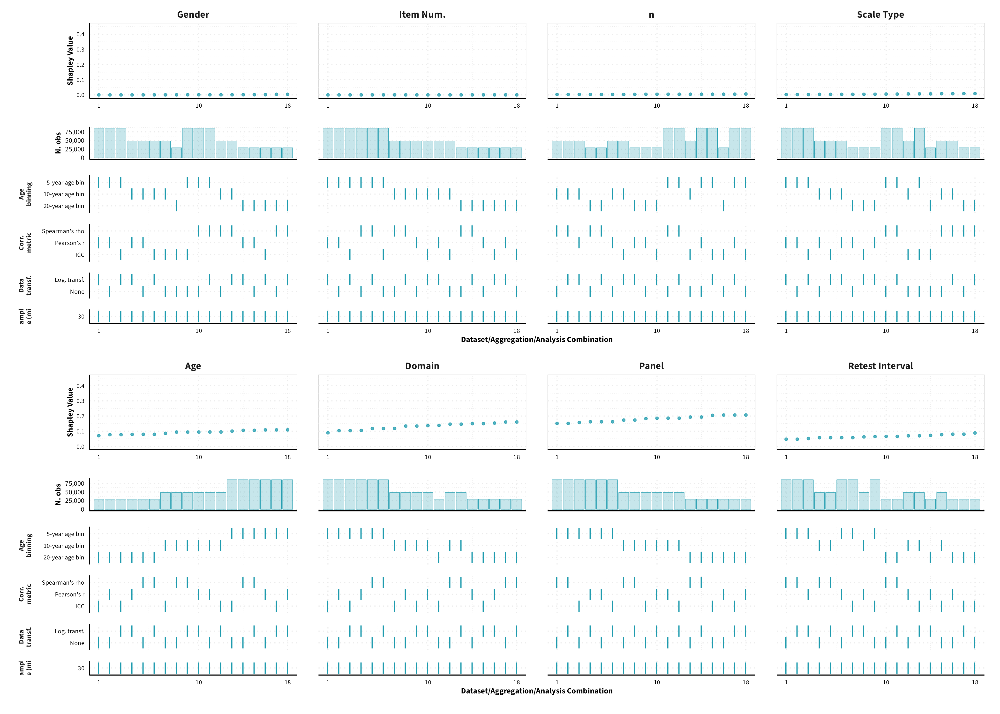
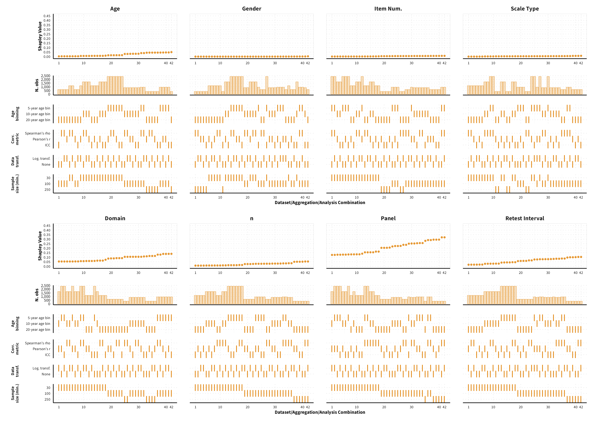
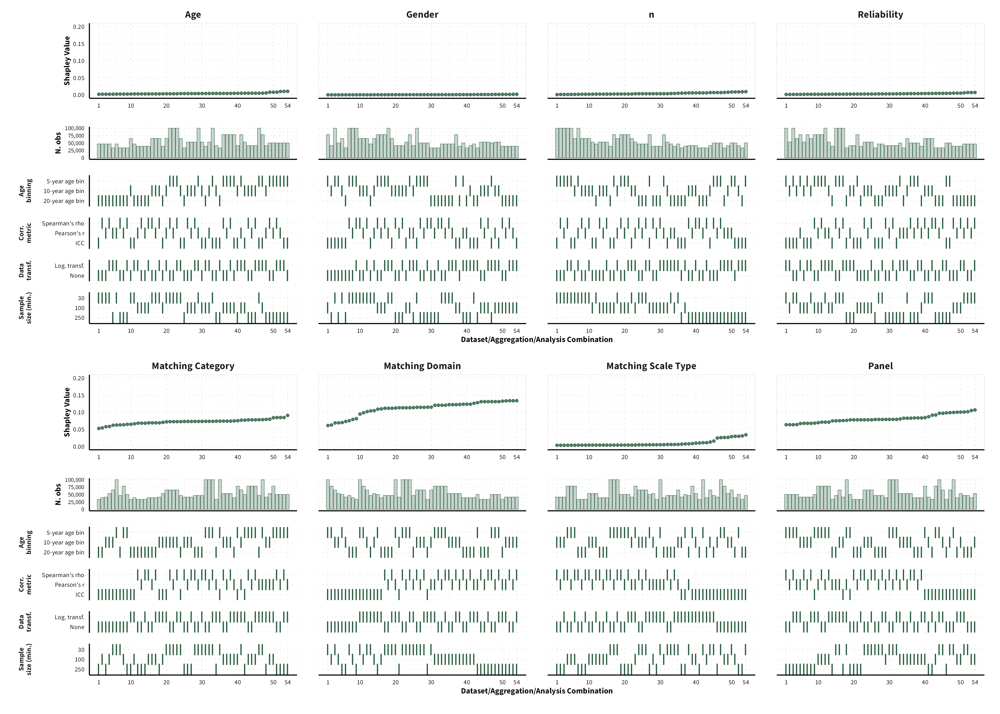
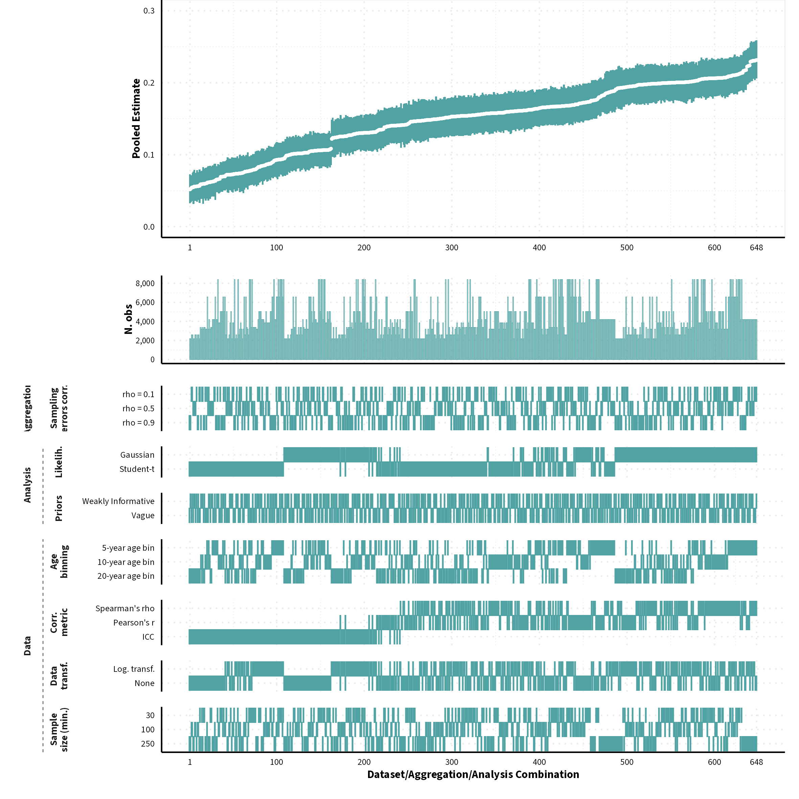

<!-- <style type="text/css"> -->
<!-- .main-container { -->
<!-- max-width: 1200px !important; -->
<!-- margin-left: auto; -->
<!-- margin-right: auto; -->
<!-- } -->
<!-- </style> -->


<!-- <style type="text/css"> -->
<!--   body{ -->
<!--   font-size: 12pt; -->
<!--   font-family: "Source Sans 3"; -->
<!-- } -->
<!-- </style> -->


```{r, include=FALSE}
knitr::opts_chunk$set(echo = FALSE, message = FALSE, warning = FALSE)

# options(width = 3000)

library(tidyverse)
library(kableExtra)
library(knitr)
library(ggdist)
library(brms)
library(patchwork)
library(posterior)
library(bayesplot)
library(ggplot2)
library(rstanarm)
library(data.table)
library(boot)
library(DT)
library(GGally)
library(MetBrewer)


rename_domain <- function(x, meas = "x"){
  x_lbl = case_when( x == "soc" ~ "Social",
                     x == "sex" ~ "Sexual Intercourse",
                     x == "eth" ~ "Ethical",
                     x == "inv" ~ "Investment",
                     x == "gam" ~ "Gambling",
                     x == "hea" & meas == "pro" ~ "General Health",
                     x == "gen" ~ "General Risk",
                     x == "all" ~  "**Overall**",
                     x == "dri" ~ "Driving",
                     x == "smo" ~ "Smoking",
                     x == "alc" ~ "Alcohol",
                     x == "ins" ~ "Insurance",
                     x == "occ" ~ "Occupational",
                     x == "dru" ~ "Drugs",
                     x == "gen" ~ "General",
                     x == "eth" ~ "Ethical",
                     x == "rec" ~ "Recreational")
  
  return(x_lbl)
}
color_scheme_set("teal")

```


## Brief Description


Below we provide an overview of how robust the results reported in the main paper are to different data processing and analysis decisions. To do so, we conducted the same (main) analyses using data sets derived from other combinations of data processing and model specification decisions (see diagram below). ***Refer to the [Workflow](https://cdsbasel.github.io/temprisk/workflow_overview.html) page for more information on how these analyses were conducted*** 

The plots in the different sections and tabs show in the upper panel the parameter estimate as a function of different data configuration/analysis decisions described in the lower panel (dashes indicate which option was used to process/analyze the data). The middle panel shows the number of effect sizes/correlations that were included in the analyses.

The plots have a similar format as those used for Specification Curve Analysis (Hall, Liu, Jansen, Dragicevic, Chevalier, & Kay, 2022; Simonsohn, Simmons, & Nelson, 2020)


<br>

```{r, out.width="100%", fig.cap="Overview of data processing and analysis options. Options in bold represent the results reported in the main paper."}

```


<br>

**References**

Hall, B.D., Liu, Y., Jansen, Y., Dragicevic, P., Chevalier, F. and Kay, M. (2022), A Survey of Tasks and Visualizations in Multiverse Analysis Reports. *Computer Graphics Forum, 41*, 402-426. doi: 10.1111/cgf.14443


 Simonsohn, U., Simmons, J. P., & Nelson, L. D. (2020). Specification curve analysis. *Nature Human Behaviour, 4*(11), 1208-1214. doi: 10.1038/s41562-020-0912-z


<br>

## Size of datasets {.tabset}

Based on the threshold used for the sample size (i.e., minimum of 30, 100 or 250 responses to compute the correlation) the size of the dataset varies. Below is an overview of the number of correlation coefficients for each age group for different thresholds of minimum sample size.

### Test-Retest Correlations {.tabset}
#### Non-Aggregated Correlations
```{r, out.width="100%"}

```

<br>


#### Aggregated Correlations
```{r, out.width="100%"}

```

<br>

### Inter-Correlations {.tabset}
#### Non-Aggregated Correlations
```{r, out.width="100%"}

```

<br>


#### Aggregated Correlations
```{r, out.width="100%"}

```

<br>

<br><br>

## Temporal Stability

### Variance Decomposition  {.tabset}

We were unable to estimate Shapley values for certain data sets, given that certain data points would be removed from the dataset, and we would therefore encounter either issues related to singularities or lack of levels in a categorical variable. As a result, the number of possible dataset configurations vary between measure categories.

#### Omnibus

```{r, out.width="100%"}
knitr::include_graphics("images/shapley_omni_multiverse.png")
```

<br><br><br>

#### Propensity

```{r, out.width="100%"}

```

<br><br><br>

#### Frequency

```{r, out.width="100%"}

```

<br><br><br>


#### Behaviour

```{r, out.width="100%"}

```

<br><br><br>

### Meta-Analytic Stability and Change model  {.tabset}

Predicted MASC parameter estimates (mean and 95% HDI) for each measure category and domain of risk preference for a sample of 40-year old individuals (50% female) across different data formats (visualizing for each measure category a subset of 1'944 possible specifications)


#### Propensity {.tabset}
```{r, results="asis"}

file_list <- tibble(file_path =
                      list.files(path = "images", pattern = "masc_pro_", recursive = TRUE, full.names = TRUE))  %>%
  rowwise() %>%
  mutate(tab_name = substring(file_path,17, 19) ,
         tab_name = rename_domain(tab_name, meas = "pro"))

tabs <- unique(file_list$tab_name)


# set loop for tabs

for(curr_tab in tabs){
  
  
  cat("##### ", curr_tab, "\n") #
  
  cat("\n", "</center>", "\n")
  
  cat(paste0("{width=100%}"))
  
  
  cat("\n", "</center>", "\n")
  
  cat("<br><br><br>")
  
  cat("\n\n\n\n")
  
}
```


<br><br><br>

#### Frequency {.tabset}
```{r, results="asis"}

file_list <- tibble(file_path =
                      list.files(path = "images", pattern = "masc_fre_", recursive = TRUE, full.names = TRUE))  %>%
  rowwise() %>%
  mutate(tab_name = substring(file_path,17, 19),
         tab_name = rename_domain(tab_name))

tabs <- unique(file_list$tab_name)


# set loop for tabs

for(curr_tab in tabs){
  
  
  cat("##### ", curr_tab, "\n") #
  
  cat("\n", "</center>", "\n")
  
  cat(paste0("{width=100%}"))
  
  
  cat("\n", "</center>", "\n")
  
  cat("<br><br><br>")
  
  cat("\n\n\n\n")
  
}
```


<br><br><

#### Behaviour {.tabset}
```{r, results="asis"}

file_list <- tibble(file_path =
                      list.files(path = "images", pattern = "masc_beh_", recursive = TRUE, full.names = TRUE))  %>%
  rowwise() %>%
  mutate(tab_name = substring(file_path,17, 19),
         tab_name = case_when(grepl("ins", tab_name)  ~ "Insurance",
                                 grepl("gam", tab_name)  ~ "Gambling",
                                 grepl("occ", tab_name)  ~ "Occupational",
                                 grepl("inv", tab_name)  ~ "Investment"))

tabs <- unique(file_list$tab_name)


# set loop for tabs

for(curr_tab in tabs){
  
  
  cat("##### ", curr_tab, "\n") #
  
  cat("\n", "</center>", "\n")
  
  cat(paste0("{width=100%}"))
  
  
  cat("\n", "</center>", "\n")
  
  cat("<br><br><br>")
  
  cat("\n\n\n\n")
  
}
```

<br>


<br><br>


## Convergent Validity

### Variance Decomposition

We were unable to estimate Shapley values for certain data sets, given that certain data points would be removed from the dataset, and we would therefore encounter either issues related to singularities or lack of levels in a categorical variable. 


```{r, out.width="100%"}

```

<br><br><br>


### Meta-Analysis {.tabset}

#### Overall
```{r, out.width="100%"}

```

<br>

#### By Measure Pairs {.tabset}

```{r, results="asis"}

file_list <- tibble(file_path =
                      list.files(path = "images", pattern = "convergent_ma_measure_", recursive = TRUE, full.names = TRUE))  %>%
  rowwise() %>%
  mutate(tab_name = substring(file_path,30, nchar(file_path)-15))

tabs <- unique(file_list$tab_name)


# set loop for tabs

for(curr_tab in tabs){
  
  
  cat("##### ", curr_tab, "\n") #
  
  cat("\n", "</center>", "\n")
  
  cat(paste0("{width=100%}"))
  
  
  cat("\n", "</center>", "\n")
  
  cat("<br><br><br>")
  
  cat("\n\n\n\n")
  
}
```

<br>
