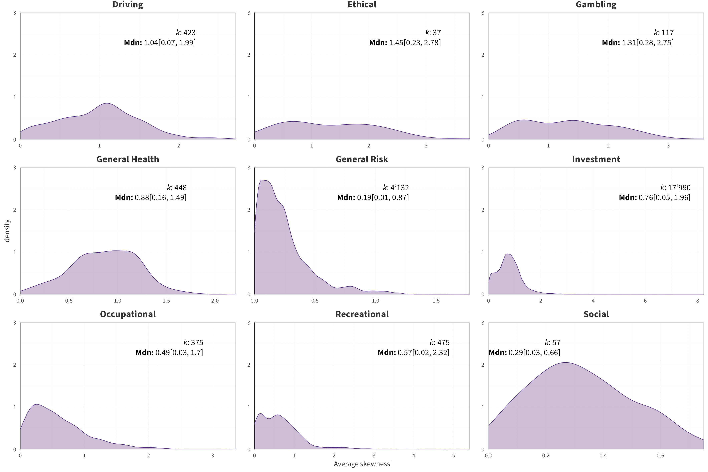
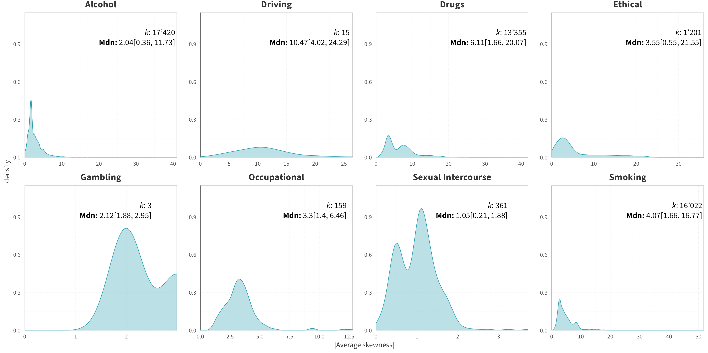
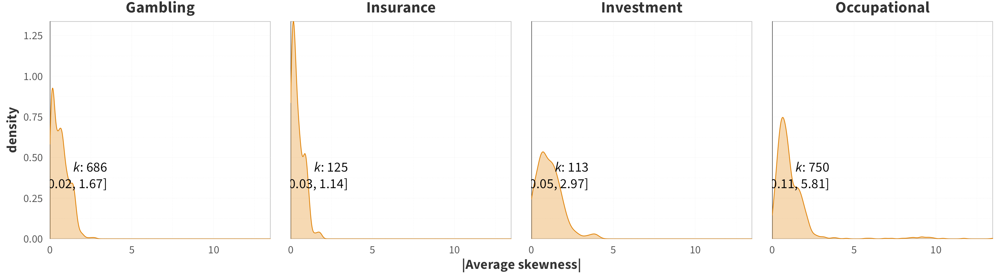

<!-- <style type="text/css"> -->
<!-- .main-container { -->
<!-- max-width: 1200px !important; -->
<!-- margin-left: auto; -->
<!-- margin-right: auto; -->
<!-- } -->
<!-- </style> -->


<!-- <style type="text/css"> -->
<!--   body{ -->
<!--   font-size: 12pt; -->
<!--   font-family: "Source Sans 3"; -->
<!-- } -->
<!-- </style> -->


```{r, include=FALSE}
knitr::opts_chunk$set(echo = FALSE, message = FALSE, warning = FALSE)

# options(width = 3000)

library(tidyverse)
library(kableExtra)
library(knitr)
library(ggdist)
library(brms)
library(patchwork)
library(posterior)
library(bayesplot)
library(ggplot2)
library(rstanarm)
library(data.table)
library(boot)
library(DT)
library(GGally)
library(MetBrewer)

color_scheme_set("teal")

```


## Brief Description

<br>


Below we provide supplementary information on the test-retest correlations that were included in the analyses. Using the original test-retest correlations, we plot the distributions of the absolute mean skewness of the responses from the two data collection time points, split by measure category and domain.


<br>

## Temporal Stability
### Skewness of Responses {.tabset}
#### Propensity

```{r}

```

<br><br>


#### Frequency 
```{r}

```

<br><br>

#### Behaviour 
```{r}

```

<br><br>

