<!-- <style type="text/css"> -->
<!-- .main-container { -->
<!-- max-width: 1200px !important; -->
<!-- margin-left: auto; -->
<!-- margin-right: auto; -->
<!-- } -->
<!-- </style> -->


<!-- <style type="text/css"> -->
<!--   body{ -->
<!--   font-size: 12pt; -->
<!--   font-family: "Helvetica"; -->
<!-- } -->
<!-- </style> -->


```{r, include=FALSE}
knitr::opts_chunk$set(echo = FALSE, message = FALSE, warning = FALSE)

# options(width = 3000)

library(tidyverse)
library(kableExtra)
library(knitr)
library(ggdist)
library(brms)
library(patchwork)
library(posterior)
library(bayesplot)
library(ggplot2)
library(rstanarm)
library(data.table)
library(boot)
library(DT)
library(GGally)
library(MetBrewer)
library(gt)

```


## Brief Description

Below, we present an overview of each predictor included in the variance decomposition analysis of the test-retest correlations and inter-correlations. We plot the distributions of the correlations, split into the different levels of each categorical predictor, displaying the mean (light-colored dot) and median (dark-colored dot) values.

<br>

### Retest-Correlations { .tabset}

#### Omnibus { .tabset}


##### By Category
```{r}
 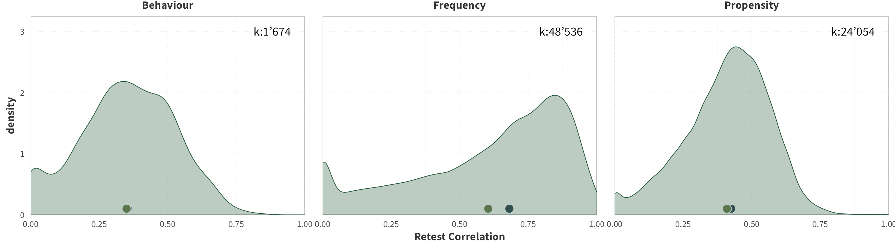
```


<br>

##### By Domain
```{r}
 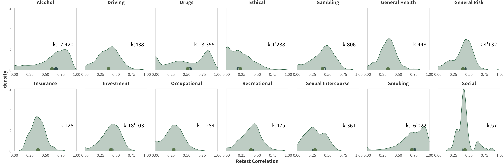
```


<br>

##### By Scale Type
```{r}
 knitr::include_graphics("images/scale_overview_omnibus.png")
```


<br>

##### By Age
```{r}
 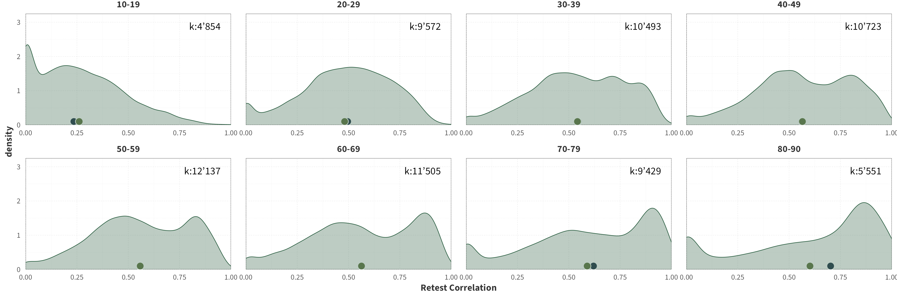
```


<br>


##### By Gender
```{r}
 knitr::include_graphics("images/gender_overview_omnibus.png")
```


<br>

##### By Panel
```{r}
 knitr::include_graphics("images/panel_overview_omnibus.png")
```


<br>

##### By Sample Size
```{r}
 knitr::include_graphics("images/n_overview_omnibus.png")
```

<br>

##### By Retest Interval
```{r}
 knitr::include_graphics("images/time_overview_omnibus.png")
```

<br>


#### Propensity { .tabset}


##### By Domain
```{r}
 knitr::include_graphics("images/domain_overview_pro.png")
```


<br>

##### By Scale Type
```{r}
 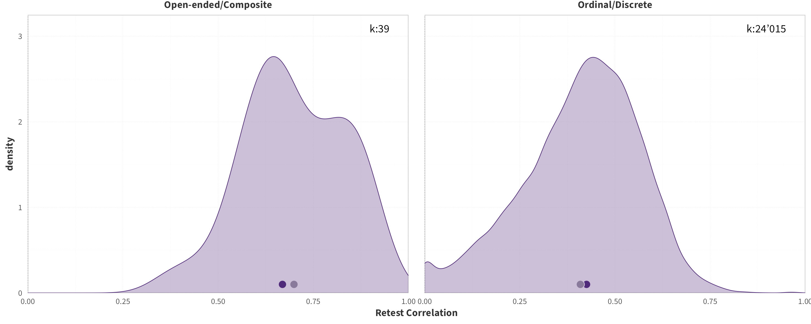
```


<br>

##### By Age
```{r}
 knitr::include_graphics("images/age_overview_pro.png")
```


<br>


##### By Gender
```{r}
 knitr::include_graphics("images/gender_overview_pro.png")
```


<br>

##### By Panel
```{r}
 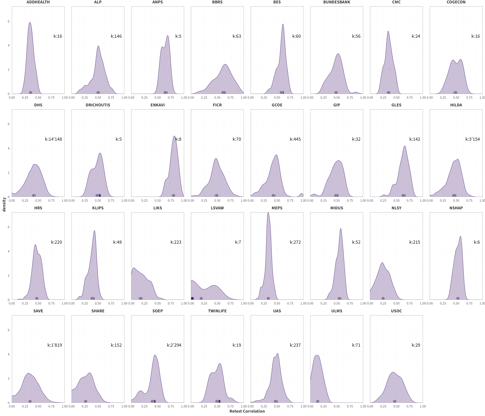
```


<br>

##### By Sample Size
```{r}
 knitr::include_graphics("images/n_overview_pro.png")
```


<br>

##### By Retest Interval
```{r}
 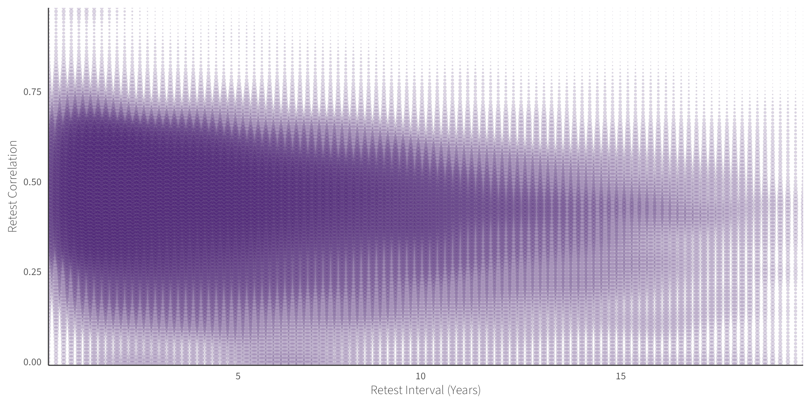
```

<br>


#### Frequency { .tabset}


##### By Domain
```{r}
 knitr::include_graphics("images/domain_overview_fre.png")
```


<br>

##### By Scale Type
```{r}
 knitr::include_graphics("images/scale_overview_fre.png")
```


<br>

##### By Age
```{r}
 knitr::include_graphics("images/age_overview_fre.png")
```


<br>


##### By Gender
```{r}
 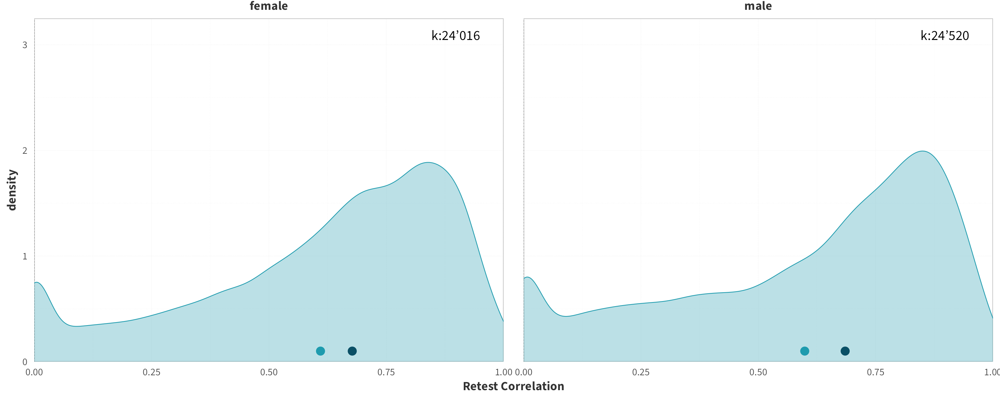
```


<br>

##### By Panel
```{r}
 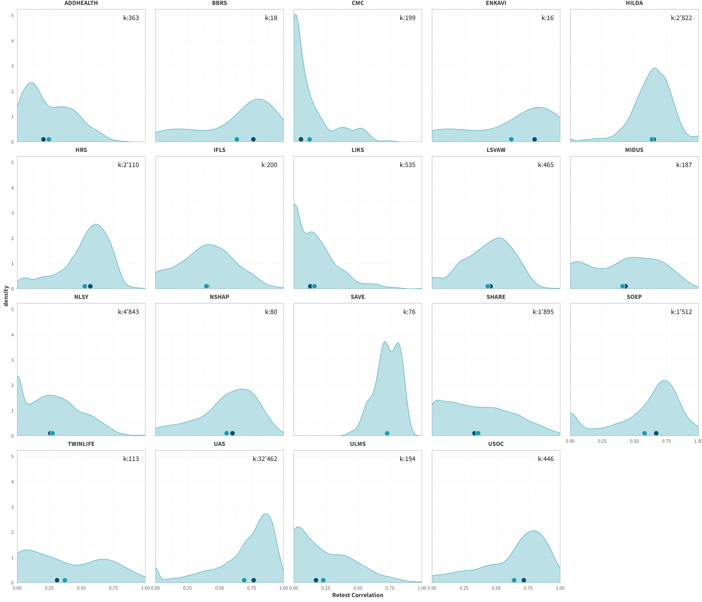
```


<br>

##### By Sample Size
```{r}
 knitr::include_graphics("images/n_overview_fre.png")
```


<br>

##### By Retest Interval
```{r}
 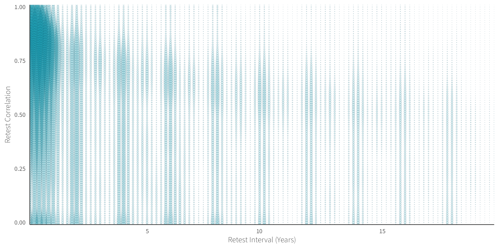
```

<br>


#### Behaviour { .tabset}


##### By Domain
```{r}
 knitr::include_graphics("images/domain_overview_beh.png")
```


<br>

##### By Scale Type
```{r}
 knitr::include_graphics("images/scale_overview_beh.png")
```


<br>

##### By Age
```{r}
 knitr::include_graphics("images/age_overview_beh.png")
```


<br>


##### By Gender
```{r}
 knitr::include_graphics("images/gender_overview_beh.png")
```


<br>

##### By Panel
```{r}
 knitr::include_graphics("images/panel_overview_beh.png")
```


<br>

##### By Sample Size
```{r}
 knitr::include_graphics("images/n_overview_beh.png")
```


<br>

##### By Retest Interval
```{r}
 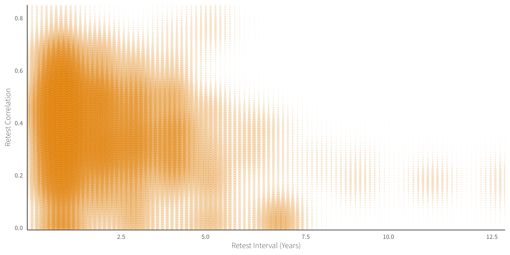
```

<br>

### Inter-Correlations { .tabset}


#### By Matching Domain
```{r}
 knitr::include_graphics("images/domain_overview_intercor.png")
```


<br>

#### By Matching Scale Type
```{r}
 knitr::include_graphics("images/scale_overview_intercor.png")
```

<br>

#### By Matching Category
```{r}
 knitr::include_graphics("images/categ_overview_intercor.png")
```


<br>

#### By Age
```{r}
 knitr::include_graphics("images/age_overview_intercor.png")
```


<br>


#### By Gender
```{r}
 knitr::include_graphics("images/gender_overview_intercor.png")
```


<br>

#### By Panel
```{r}
 knitr::include_graphics("images/panel_overview_intercor.png")
```


<br>

#### By Sample Size
```{r}
 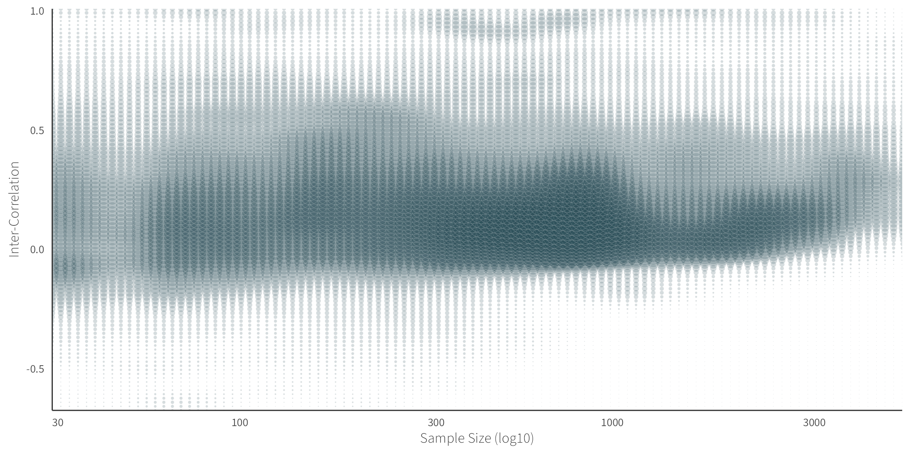
```


<br>


#### By Reliability
```{r}
 knitr::include_graphics("images/rel_overview_intercor.png")
```


<br>


